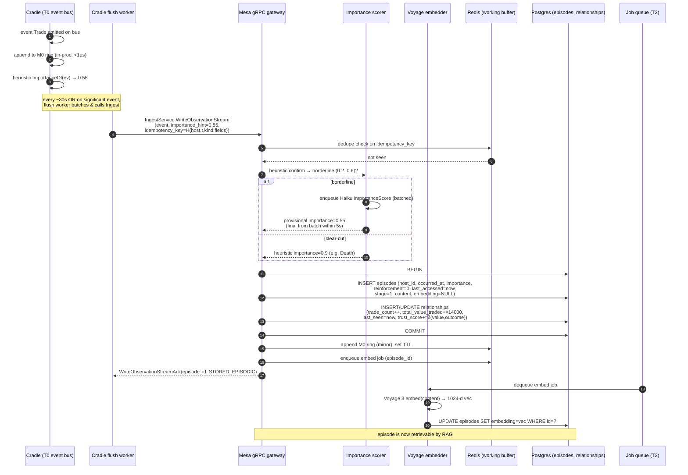
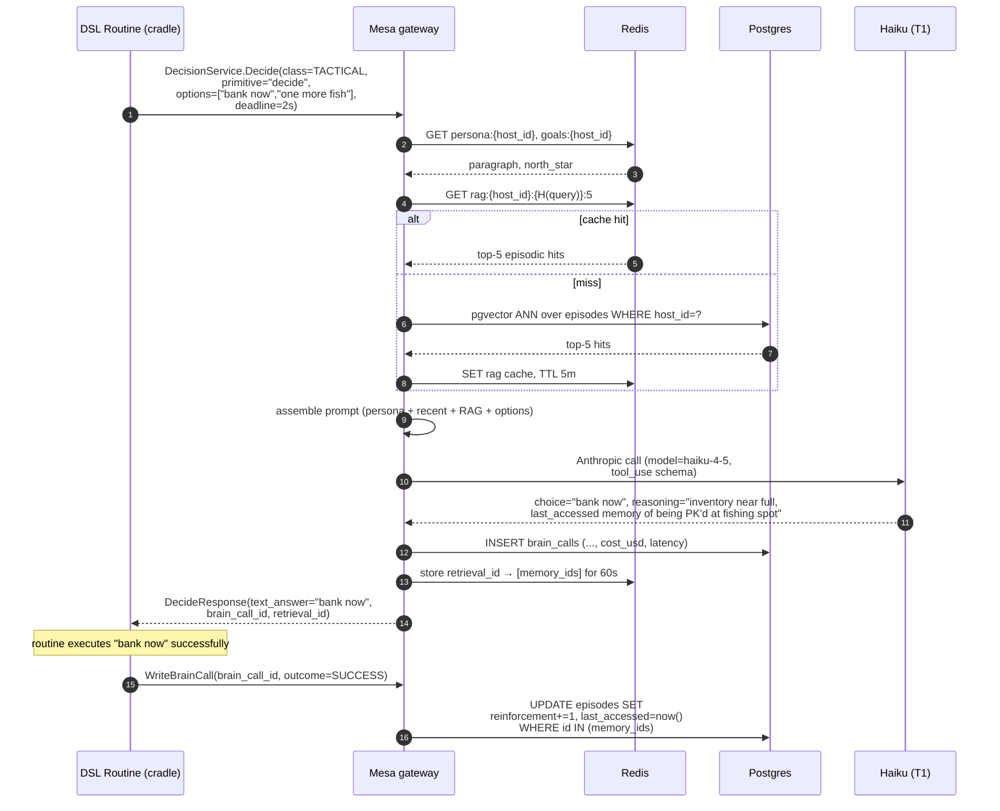
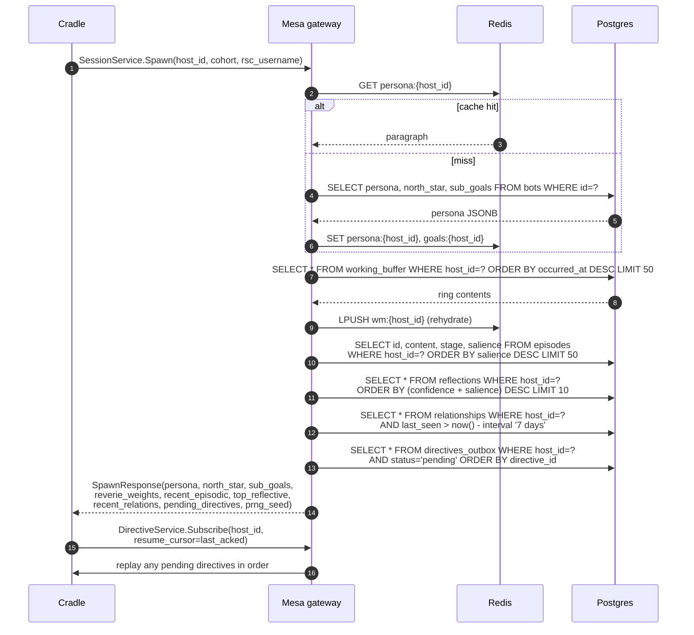
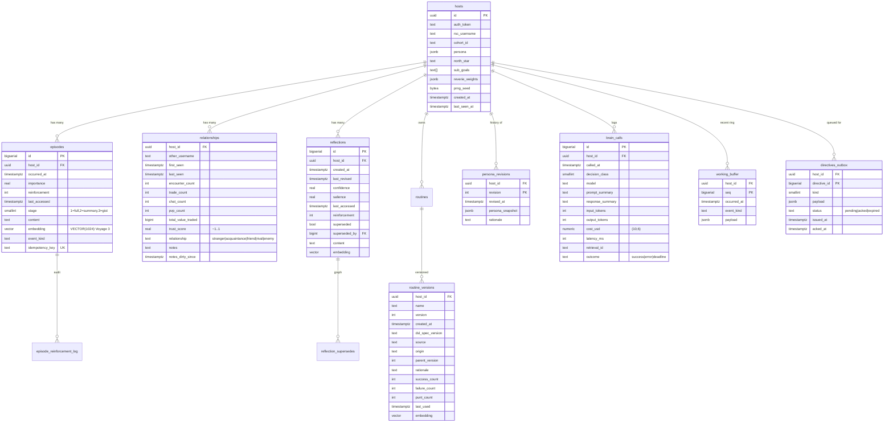

# Mesa over gRPC: a buildable cognition-service architecture for Westworld

This revision replaces the prior cradle↔mesa HTTP surface with a fully specified gRPC contract and, for the first time, architects the memory subsystem end-to-end. **The two load-bearing changes are (1) every cross-boundary interaction now lives in a small set of gRPC services with explicit deadlines tied to the tiered-brain latency budgets, and (2) memory has a concrete five-tier lifecycle covering creation, embedding, retrieval, reinforcement, compaction, and culling, fronted by Redis and persisted in Postgres + pgvector.** The cradle/mesa middle-split authority model, the tiered brain (T0 reflex in cradle; T1 Haiku / T2 Sonnet in mesa; T3 background crons), and the persona/memory schema established in prior revisions are preserved verbatim and only refined where the new transport or the memory lifecycle demand it. A new Redis hot-cache tier sits between the gRPC gateway and Postgres to absorb the read traffic that 500 hosts will generate, and a River-style job queue runs the T3 background work (reflection, compression, decay, trust decay, reverie rebaseline, persona revision). Concrete .proto-style message shapes are provided as starting points; the user has explicitly flagged that the wire schema is not finalized, so the proto fragments below are illustrative, not normative, and the paper says so wherever it matters.

---

## 1. What changed in this revision

Prior versions described mesa as a single Go service behind a REST/HTTP API, named the brain tiers (T0/T1/T2/T3), and sketched memory as four conceptual categories (working/episodic/relational/reflective) without specifying how a raw game event becomes a stored memory, who writes it, when it gets embedded, how it ages, or what culls it. **This revision keeps the conceptual architecture and changes four concrete things.**

First, **the transport is now gRPC** with five logical services — `DecisionService`, `IngestService`, `DirectiveService`, `MemoryService`, and `SessionService` — covering every cross-boundary action enumerated from the docs (the Tier 1–5 stdlib primitives, the four `brain.Decision` outcomes, persona/relationship fetches, working-memory flush, brain-call ledger writes, session lifecycle, and the asynchronous mesa→cradle directive stream). Deadlines are inherited from the tiered-brain latency budgets (T1 ≤2s p99, T2 ≤6s p99) and degradation behavior is fully specified.

Second, **the memory subsystem is now architected end-to-end** as a five-tier taxonomy (M0 working → M1 episodic → M2 relational → M3 reflective/semantic → M4 identity/persona) with a documented lifecycle for each tier covering "made, written, embedded, retrieved, reinforced, compacted, and culled." This finally answers the long-open question of what turns an `event.Trade` into an `episodes` row, when the Voyage-3 vector is computed, how `idx_episodes_bot_salience` is updated on retrieval, and what the hourly compression sweep actually does to a Stage-1 episode.

Third, **Redis is introduced** as a hot cache and a fan-out substrate. Redis holds the current persona paragraph, the recent-episode ring buffer, top-K RAG results for the last few decisions, the directive-stream subscription table, and the cron coordination locks. Postgres remains the system of record; Redis is write-through for working memory and read-through for hot RAG.

Fourth, **a River-style job queue** runs all T3 background work with per-host fairness, idempotency tokens, and a clean path from job output to a `DirectiveService` push. The four T3 job classes (reflection, compression/decay, trust decay, reverie rebaseline) and the rare persona-revision job are specified with cadence, trigger, and directive shape.

Two things deliberately did **not** change. The middle-split authority model is intact — mesa remains the system of record; cradle remains a stateless execution shell whose loss is acceptable. And the Postgres schema from `docs/mesa.md` (`bots`, `episodes`, `relationships`, `reflections`, `routines`, `routine_versions`, `persona_revisions`, `brain_calls`, `knowledge_chunks`, with `VECTOR(1024)` Voyage-3 embeddings and the planned `bots→hosts` rename) is taken as fixed; this paper only adds the salience/decay/reinforcement columns the lifecycle requires and the Redis-side structures.

---

## 2. Architecture overview, now with gRPC and Redis on the diagram

Westworld runs as three binaries: `cmd/cradle` (per-host, one process per logged-in OpenRSC character; today's working code), `cmd/mesa` (one DRY master cognition service for the entire host population; this paper's subject), and `cmd/delos` (orchestrator and observability UI, out of scope). Each cradle owns layers 1–5 from `docs/layers.md` (wire/session, world mirror, action/event, DSL runtime, reveries-T0-reflex) and **holds only ephemeral working state**; if a cradle process dies the OpenRSC host logs out, which is the desired clean failure mode. Mesa owns layers 6 and 7 (cognition retrieval, brain T1/T2 inference, memory of every kind, personas, goals, trust ledgers, reflections) and is the **single system of record** for all 500 hosts' durable cognition.

The interaction across the cradle/mesa boundary is **bidirectional**. Cradle initiates synchronous calls into mesa whenever the DSL hits a stdlib primitive that crosses the network (every Tier 1, 2, 3 call from `docs/dsl.md`), whenever it needs persona/relationship/goal hydration on spawn, and whenever it needs to flush working memory or a brain-call ledger row. Mesa initiates asynchronous pushes down to cradle through a server-streamed `DirectiveService` whenever a T3 cron produces a fact that cradle needs to know (a new reflection, a goal revision, a trust-decay outcome, a new reverie weight vector, a persona-revision directive). T0 reveries never touch the network in the hot path; they run in cradle between every atomic action with `<50µs` per `reverie.tick()`, fed by the persona paragraph and current emotional state cached locally from the most recent rebaseline directive.

```
                                    ┌─────────────────────────────────────────────────────┐
                                    │                       mesa                          │
                                    │   (one DRY service for the entire 500-host pop.)    │
                                    │                                                     │
                                    │  ┌───────────────┐    ┌────────────────────────┐    │
                                    │  │ gRPC gateway  │◀──▶│ DecisionService (T1/T2)│    │
                                    │  │ (auth, host_  │    │ IngestService          │    │
                                    │  │  id scoping,  │    │ MemoryService          │    │
                                    │  │  deadlines)   │    │ SessionService         │    │
                                    │  └───────┬───────┘    │ DirectiveService (srv→ │    │
                                    │          │            │   stream)              │    │
                                    │          │            └─────────┬──────────────┘    │
                                    │  ┌───────▼─────────────────┐    │                   │
                                    │  │ Redis (hot cache)       │    │                   │
                                    │  │ persona ¶, goals, top-K │    │                   │
                                    │  │ RAG, recent-episode ring│    │                   │
                                    │  │ buffer, directive subs, │    │                   │
                                    │  │ cron locks              │    │                   │
                                    │  └───────┬─────────────────┘    │                   │
                                    │          │                      │                   │
                                    │  ┌───────▼──────────────────────▼────────────────┐  │
                                    │  │ Postgres + pgvector (system of record)        │  │
                                    │  │ hosts, episodes, relationships, reflections,  │  │
                                    │  │ routines/_versions, persona_revisions,        │  │
                                    │  │ brain_calls, knowledge_chunks, working_buffer │  │
                                    │  └────────────────────────────┬──────────────────┘  │
                                    │                               │                     │
                                    │  ┌────────────────────────────▼──────────────────┐  │
                                    │  │ River-style job queue (T3 crons)              │  │
                                    │  │ reflection │ compression/decay │ trust decay  │  │
                                    │  │ reverie rebaseline │ persona revision         │  │
                                    │  │ Anthropic: Sonnet 4.6 / Haiku 4.5             │  │
                                    │  │ Voyage 3 embedder (1024-dim)                  │  │
                                    │  └───────────────────────────────────────────────┘  │
                                    └───────────────────▲─────────────────────────────────┘
                                                        │ gRPC (HTTP/2, mTLS, host_id auth)
                                                        │ unary + server-streaming
            ┌───────────────────────────────────────────┼──────────────────────────────────────┐
            │                                           │                                      │
      ┌─────┴──────┐                              ┌─────┴──────┐                          ┌────┴───────┐
      │ cradle #1  │                              │ cradle #2  │             ...          │ cradle #N  │
      │            │                              │            │                          │            │
      │ layers 1–5 │                              │ layers 1–5 │                          │ layers 1–5 │
      │  + T0      │                              │  + T0      │                          │  + T0      │
      │ reverie    │                              │ reverie    │                          │ reverie    │
      │ (local     │                              │ (local     │                          │ (local     │
      │  PRNG,     │                              │  PRNG,     │                          │  PRNG,     │
      │  <50µs)    │                              │  <50µs)    │                          │  <50µs)    │
      └─────┬──────┘                              └─────┬──────┘                          └────┬───────┘
            │ RSC wire protocol (proto/v235, ISAAC)     │                                      │
            └───────────────────────────────────────────┴──────────────────────────────────────┘
                                                        │
                                              ┌─────────▼──────────┐
                                              │ OpenRSC server     │
                                              │ (westworld.conf)   │
                                              └────────────────────┘
```

The middle-split is recoverable across faults in both directions. **If mesa goes away, cradle falls back to T0 reveries plus the cached persona paragraph and the most-recently-pushed directive set**, executes whatever routine is currently in flight to its next yield point, and then either retries the failed RPC with backoff (for non-urgent classes) or logs out (for `ChatReply` and `Tactical` deadline failures that have no safe fallback). **If a cradle disappears**, mesa's directive stream subscriber for that `host_id` simply becomes inactive; pending directives buffer in Redis with a TTL until that host reconnects and re-subscribes, at which point a resync handshake replays anything still live.

---

## 3. The gRPC interface

This section enumerates **every** action that crosses the cradle/mesa boundary, groups them into five services, gives illustrative `.proto`-style message shapes, and specifies the consistency, caching, timeout, and reconnect semantics. The message shapes are **starting points** — the user has explicitly noted the client schema is not yet finalized, so field names and types below should be treated as a working draft, not a final wire contract. Where a field's exact representation depends on a decision not yet made (for example, whether `Action` is encoded as a tagged union of typed messages or as a serialized DSL fragment), the paper marks it explicitly.

### 3.1 Inventory of cross-boundary actions

From the docs, every call that needs to traverse the cradle/mesa boundary falls into one of seven concrete patterns. **Pattern A is synchronous tactical decisions** — the DSL primitives `decide()`, `evaluate()`, `contemplate_reality()`, and the cognition-level `RoutineSelect`/`ChatReply`/`Reactive` triggers — which map onto `DecisionClass = {Tactical, ChatReply, Reactive, RoutineSelect, ImportanceScore}` running on Haiku 4.5 (T1). **Pattern B is synchronous strategic decisions** — `contemplate_reality()` when the routing dispatch decides it has earned Sonnet, plus `exec()` and `improvise()` for DSL script generation — mapping onto `DecisionClass = {Strategic, ScriptGen}` running on Sonnet 4.6 (T2). **Pattern C is synchronous memory primitives** — `recall(query, top=5)`, `relation_with(name)`, `note(text)`, and `reflect_now()` — which hit mesa's memory layer (vector search, structured lookup, journal write, on-demand reflection). **Pattern D is asynchronous observation ingest** — every game event the cradle observes that is worth persisting (trades, deaths, level-ups, chats received, NPC kills, item finds, scams) flows through `IngestService.WriteObservation`. **Pattern E is the mesa→cradle directive stream**, server-streamed over a long-lived gRPC call that delivers reflection results, goal revisions, trust-decay outcomes, reverie-weight rebaseline vectors, and persona-revision directives. **Pattern F is session lifecycle** — registration, spawn, heartbeat, graceful logout, dropped-connection resync. **Pattern G is bulk read on spawn** — persona paragraph, north star, sub-goals, active directives, recent reflections — which hydrates the cradle's local cache.

The architectural rule from prior revisions still holds: **the tier is selectable purely from local state**. The DSL primitive name determines the tier and the mesa gateway dispatches on the primitive (or, equivalently, on the `decision_class` field in the request); no LLM is in the loop for tier selection.

### 3.2 Service definitions

**DecisionService** carries all synchronous brain calls. Methods are unary because they are request/response and the client has a hard deadline. The service is intentionally narrow — a single `Decide` method that takes a discriminated request and returns a discriminated response — because tiered routing already lives inside the brain layer and exposing nine separate RPCs would be ceremony without benefit. The exception is `GenerateScript` (for `exec`/`improvise`/`ScriptGen`), which gets its own method because its response is a DSL source fragment rather than a `Decision` union and its deadline budget is different (Sonnet, ≤6s p99).

**IngestService** carries the asynchronous observation write path. `WriteObservation` is unary but the cradle treats it as fire-and-forget with a short deadline (250ms) and a local retry buffer; `WriteObservationStream` exists as a client-streamed variant for batch flushes (the ~30s working-memory→episodic flush from `docs/architecture.md`). `WriteBrainCall` writes a `brain_calls` ledger row; mesa itself writes these for T1/T2 calls it served, but cradle writes them too for any local decision branches it wants observable.

**MemoryService** carries synchronous memory reads and structured writes that aren't bulk observation ingest. `Recall` is the `recall(query, top=5)` primitive (vector search over the host's own episodic memory). `GetRelationship` and `BatchGetRelationships` serve `relation_with(name)` and the cognition-bundle relationship fetch. `QueryKnowledge` serves the wiki/corpus RAG (`docs/cognition.md`). `WriteJournal` serves `note(text)`. `RequestReflection` triggers an on-demand `reflect_now()` (synchronous, Sonnet, capped at one per routine instance).

**DirectiveService** is **the only server-streamed RPC in the system** and is the asynchronous channel from mesa down to cradle. `Subscribe` opens a long-lived stream keyed on `host_id` + a `cradle_session_id` and emits `Directive` envelopes as T3 cron output materializes. Streaming is justified because: (1) directives are inherently push from a service that observes background events the client cannot poll for cheaply, (2) ordering within a host's directive sequence matters for goal-revision idempotency, and (3) one long-lived HTTP/2 stream is cheaper at 500-host fan-out than 500 hosts polling on a tight interval. The fallback when the stream drops is documented in §3.5.

**SessionService** carries the lifecycle: `Register` (host first-spawn with cohort + persona generation), `Spawn` (existing host coming online — returns the hydration bundle in one round trip), `Heartbeat` (5s cadence, matching `protocol.md`'s `HeartbeatInterval`), `Logout` (graceful, flushes working memory), and `Resync` (after a dropped stream — returns missed directives and re-establishes the subscription cursor).

```proto
// ILLUSTRATIVE — schema is not finalized. Field names, types, and groupings
// will change as the cradle's internal types stabilize. Treat as a starting
// point for the .proto package.
syntax = "proto3";
package westworld.mesa.v1;

import "google/protobuf/timestamp.proto";
import "google/protobuf/duration.proto";

// ============================ Common =========================================

message HostRef {
  string host_id = 1;          // UUID; per-host isolation enforced server-side
  string cradle_session_id = 2; // opaque, set at Spawn; lets mesa correlate
                                // directive streams with the right process
}

enum DecisionClass {
  DECISION_CLASS_UNSPECIFIED = 0;
  STRATEGIC          = 1;  // Sonnet 4.6, T2
  SCRIPT_GEN         = 2;  // Sonnet 4.6, T2
  ROUTINE_SELECT     = 3;  // Haiku 4.5,  T1
  TACTICAL           = 4;  // Haiku 4.5,  T1
  CHAT_REPLY         = 5;  // Haiku 4.5,  T1
  REACTIVE           = 6;  // Haiku 4.5,  T1
  IMPORTANCE_SCORE   = 7;  // Haiku 4.5,  T1 (batchable, see §5)
  REFLECTION         = 8;  // Sonnet 4.6, T3 cron, exposed via RequestReflection
  PERSONA_AUDIT      = 9;  // Sonnet 4.6, T3 cron (rare, no client RPC)
}

// ============================ DecisionService ================================

service DecisionService {
  rpc Decide          (DecideRequest)           returns (DecideResponse);
  rpc GenerateScript  (GenerateScriptRequest)   returns (GenerateScriptResponse);
}

message DecideRequest {
  HostRef host = 1;
  DecisionClass decision_class = 2;

  // The triggering primitive name (e.g. "decide", "evaluate",
  // "contemplate_reality", "wait_for_chat") so mesa can apply the right
  // tool-use schema and per-primitive caps.
  string primitive = 3;

  // Free-form question/situation/options payload. The exact shape is
  // primitive-specific; modeled as a tagged oneof for clarity.
  oneof payload {
    EvaluatePayload          evaluate          = 10;
    DecidePayload            decide_choice     = 11;
    ContemplatePayload       contemplate       = 12;
    RoutineSelectPayload     routine_select    = 13;
    ChatReplyPayload         chat_reply        = 14;
    ReactivePayload          reactive          = 15;
    ImportanceScorePayload   importance        = 16;
  }

  // Context bundle (T1 may use a thin slice, T2 uses full).
  ContextBundle context = 20;

  // Cradle-side correlation id for tracing.
  string trace_id = 30;
}

message ContextBundle {
  // Persona paragraph + north star are cached in Redis; cradle can omit and
  // mesa will hydrate from its own cache. Sent inline when cradle wants to
  // override (e.g. simulation-time persona injection from delos).
  PersonaParagraph persona = 1;
  string north_star = 2;
  repeated string sub_goals = 3;

  // World snapshot subset.
  WorldView world = 4;

  // Working-memory ring buffer slice (most recent ~20 events).
  repeated EventRecord recent_events = 5;

  // RAG hits, if cradle already fetched them; otherwise mesa retrieves.
  repeated MemoryHit episodic_hits = 6;
  repeated MemoryHit reflective_hits = 7;
  repeated KnowledgeChunk knowledge_hits = 8;

  // Nearby relationships (other RSC players within view).
  repeated RelationshipSummary relations = 9;

  // Routine index (for RoutineSelect).
  repeated RoutineRef routine_index = 10;

  // Urgent event for Reactive class.
  EventRecord urgent_event = 11;
}

message DecideResponse {
  // Mirrors brain.Decision: RunRoutine | WriteRoutine | DirectAction | Idle.
  oneof decision {
    RunRoutine    run_routine    = 1;
    WriteRoutine  write_routine  = 2;  // see GenerateScript for ScriptGen
    DirectAction  direct_action  = 3;
    IdleDecision  idle           = 4;
    // Primitive-typed results for evaluate/decide/contemplate:
    string        text_answer    = 5;  // contemplate_reality, decide
    float         score          = 6;  // evaluate (0..1)
  }
  TokenUsage      token_usage    = 10;
  google.protobuf.Duration latency = 11;
  string          reasoning      = 12;  // CoT excerpt
  string          model          = 13;  // "claude-haiku-4-5" | "claude-sonnet-4-6"
  string          brain_call_id  = 14;  // FK into brain_calls
}

message GenerateScriptRequest {
  HostRef host = 1;
  string primitive = 2;           // "exec" | "improvise" | "script_gen"
  string prompt = 3;
  ContextBundle context = 4;
  string parent_routine = 5;      // for exec_promotion origin tagging
}

message GenerateScriptResponse {
  string source = 1;              // DSL source, already validated server-side
  string logical_name = 2;        // "exec:<short-hash>" per docs/lang/syntax.md
  string error = 3;               // "exec_failed: <reason>" if validation failed
  TokenUsage token_usage = 4;
  google.protobuf.Duration latency = 5;
  string brain_call_id = 6;
}

// ============================ IngestService ==================================

service IngestService {
  rpc WriteObservation       (WriteObservationRequest)       returns (WriteObservationResponse);
  rpc WriteObservationStream (stream WriteObservationRequest) returns (WriteObservationStreamAck);
  rpc WriteBrainCall         (WriteBrainCallRequest)         returns (WriteBrainCallResponse);
}

message WriteObservationRequest {
  HostRef host = 1;
  string idempotency_key = 2;     // hash(host_id + occurred_at + event_kind + salient_fields)
  EventRecord event = 3;
  // Hint to importance scorer; mesa always re-scores authoritatively.
  float importance_hint = 4;
}

message WriteObservationResponse {
  string episode_id = 1;          // assigned only if event crossed the salience floor
  enum Outcome {
    STORED_EPISODIC = 0;          // wrote to episodes table
    UPDATED_RELATIONAL = 1;       // only updated relationships row
    DEDUPED = 2;                  // idempotency key matched
    DROPPED_LOW_SALIENCE = 3;     // didn't meet floor; relational counters still updated
  }
  Outcome outcome = 2;
  float assigned_importance = 3;
}

message WriteBrainCallRequest {
  HostRef host = 1;
  string brain_call_id = 2;       // pre-assigned by cradle if known, else mesa assigns
  DecisionClass decision_class = 3;
  string model = 4;
  string prompt_summary = 5;
  string response_summary = 6;
  int32 input_tokens = 7;
  int32 output_tokens = 8;
  double cost_usd = 9;            // matches NUMERIC(10,6) in brain_calls
  google.protobuf.Duration latency = 10;
  string reasoning = 11;
}

// ============================ MemoryService ==================================

service MemoryService {
  rpc Recall                (RecallRequest)               returns (RecallResponse);
  rpc GetRelationship       (GetRelationshipRequest)      returns (RelationshipRecord);
  rpc BatchGetRelationships (BatchGetRelationshipsRequest) returns (BatchGetRelationshipsResponse);
  rpc QueryKnowledge        (QueryKnowledgeRequest)       returns (QueryKnowledgeResponse);
  rpc WriteJournal          (WriteJournalRequest)         returns (WriteJournalResponse);
  rpc RequestReflection     (RequestReflectionRequest)    returns (RequestReflectionResponse);
  rpc FlushWorkingMemory    (FlushWorkingMemoryRequest)   returns (FlushWorkingMemoryResponse);
}

message RecallRequest {
  HostRef host = 1;
  string query = 2;               // natural-language; embedded server-side
  int32 top_k = 3;                // default 5 per docs/dsl.md
  // Hybrid filters: pgvector ANN + structured WHERE.
  google.protobuf.Timestamp since = 4;
  float min_salience = 5;
  repeated int32 stages = 6;      // [1,2,3] = include all but dropped
  bool include_reflective = 7;    // also pull from reflections table
}

message RecallResponse {
  repeated MemoryHit hits = 1;
  string retrieval_id = 2;        // used to reinforce these hits if the
                                  // surrounding decision succeeds
}

message MemoryHit {
  string memory_id = 1;
  enum MemoryTier {
    M_UNSPECIFIED = 0;
    M0_WORKING    = 1;
    M1_EPISODIC   = 2;
    M2_RELATIONAL = 3;
    M3_REFLECTIVE = 4;
    M4_IDENTITY   = 5;
  }
  MemoryTier tier = 2;
  int32 stage = 3;                // 1=full, 2=summary, 3=gist (episodic only)
  string content = 4;
  float similarity = 5;           // cosine from pgvector
  float salience = 6;
  google.protobuf.Timestamp occurred_at = 7;
  google.protobuf.Timestamp last_accessed = 8;
  int32 reinforcement = 9;
}

message RequestReflectionRequest {
  HostRef host = 1;
  // Synchronous reflect_now() from a routine. Mesa enqueues a high-priority
  // reflection job and waits for its result up to the deadline.
  google.protobuf.Duration max_wait = 2;
  string focus_hint = 3;          // optional; "what have I learned about JimBob?"
}

message RequestReflectionResponse {
  string reflection_id = 1;
  string content = 2;
  float confidence = 3;
}

// ============================ DirectiveService ===============================

service DirectiveService {
  // Server-streamed: mesa pushes directives to a subscribed cradle.
  rpc Subscribe (SubscribeRequest) returns (stream Directive);
  // Ack lets mesa retire a directive from the per-host outbox.
  rpc Ack       (DirectiveAck)     returns (DirectiveAckResponse);
}

message SubscribeRequest {
  HostRef host = 1;
  // Resume token from the last Ack the cradle observed. On a clean spawn this
  // is empty and mesa replays everything currently in the outbox.
  string resume_cursor = 2;
}

message Directive {
  string directive_id = 1;          // monotonic per host
  google.protobuf.Timestamp issued_at = 2;
  enum Kind {
    DIRECTIVE_UNSPECIFIED        = 0;
    REFLECTION_AVAILABLE         = 1;  // new row in reflections; invalidate cache
    GOAL_REVISION                = 2;  // north_star or sub_goals changed
    TRUST_DECAY                  = 3;  // relationship trust_score updated
    REVERIE_REBASELINE           = 4;  // new emotional/trait weight vector
    PERSONA_REVISION             = 5;  // persona JSON replaced
    DIRECTIVE_INVALIDATE_CACHE   = 6;  // generic "drop your cache for X"
    DIRECTIVE_RATE_LIMIT_NOTICE  = 7;  // mesa is under pressure; back off
  }
  Kind kind = 3;
  // Payload is kind-specific. Modeled as Any for forward-compat, but the
  // initial set is small enough to be a oneof.
  oneof payload {
    ReflectionAvailablePayload  reflection         = 10;
    GoalRevisionPayload         goal_revision      = 11;
    TrustDecayPayload           trust_decay        = 12;
    ReverieRebaselinePayload    reverie_rebaseline = 13;
    PersonaRevisionPayload      persona_revision   = 14;
    InvalidateCachePayload      invalidate         = 15;
    RateLimitNoticePayload      rate_limit         = 16;
  }
}

message DirectiveAck {
  HostRef host = 1;
  string directive_id = 2;
  enum Status { APPLIED = 0; REJECTED = 1; DEFERRED = 2; }
  Status status = 3;
  string reason = 4;
}

// ============================ SessionService =================================

service SessionService {
  rpc Register  (RegisterRequest)  returns (RegisterResponse);
  rpc Spawn     (SpawnRequest)     returns (SpawnResponse);    // hydration bundle
  rpc Heartbeat (HeartbeatRequest) returns (HeartbeatResponse);
  rpc Logout    (LogoutRequest)    returns (LogoutResponse);
  rpc Resync    (ResyncRequest)    returns (ResyncResponse);
}

message SpawnResponse {
  HostRef host = 1;
  PersonaParagraph persona = 2;     // current persona paragraph
  string north_star = 3;
  repeated string sub_goals = 4;
  ReverieWeights reverie_weights = 5;  // T0 rebaseline state
  repeated Directive pending_directives = 6;
  repeated MemoryHit recent_episodic = 7;   // last ~50, populates Redis ring
  repeated MemoryHit top_reflective = 8;    // top ~10 by salience
  repeated RelationshipSummary recent_relations = 9;
  bytes prng_seed = 10;             // deterministic reverie seed
}
```

The full set of supporting messages (`EventRecord`, `PersonaParagraph`, `RoutineRef`, `RelationshipSummary`, `TokenUsage`, the per-class `Payload` types, `KnowledgeChunk`, `RunRoutine`/`WriteRoutine`/`DirectAction`/`IdleDecision`, etc.) is intentionally elided — they map one-to-one to the Go types already named in `docs/brain.md` and `docs/mesa.md` and will be generated from those types' canonical form when the cradle code stabilizes. **Whoever lands this proto first should treat the field numbers above as reservable, not committed.**

### 3.3 Mapping the DSL stdlib and DecisionClass to RPCs

| DSL primitive / trigger | Brain tier | DecisionClass | RPC | Deadline (p99) |
|---|---|---|---|---|
| `evaluate(situation)` | T1 | `TACTICAL` (sub-kind) | `DecisionService.Decide` | 2s |
| `decide(options, ctx)` | T1 | `TACTICAL` (sub-kind) | `DecisionService.Decide` | 2s |
| `contemplate_reality(q)` | T2 | `STRATEGIC` | `DecisionService.Decide` | 6s |
| `exec(prompt)` | T2 | `SCRIPT_GEN` | `DecisionService.GenerateScript` | 6s |
| `improvise(prompt)` | T2 | `SCRIPT_GEN` | `DecisionService.GenerateScript` | 6s |
| `recall(query, top)` | (T1-adjacent retrieval; no LLM) | n/a | `MemoryService.Recall` | 400ms |
| `relation_with(name)` | retrieval | n/a | `MemoryService.GetRelationship` | 200ms |
| `reflect_now()` | T2 + T3 hybrid | `REFLECTION` | `MemoryService.RequestReflection` | 6s |
| `note(text)` | journal | n/a | `MemoryService.WriteJournal` | 200ms |
| `wait_for_chat(...)` | local | n/a | (no RPC — local on cradle) | — |
| Cognition trigger: novel situation | T1 | `ROUTINE_SELECT` | `DecisionService.Decide` | 2s |
| Cognition trigger: incoming chat | T1 | `CHAT_REPLY` | `DecisionService.Decide` | 2s |
| Cognition trigger: HP low, attacked | T1 | `REACTIVE` | `DecisionService.Decide` | 1s (tightened) |
| Observation write | T0 emit | n/a | `IngestService.WriteObservation` | 250ms fire-and-forget |
| Importance scoring (batchable) | T1 | `IMPORTANCE_SCORE` | internal to mesa | — |
| Reflection (background) | T3 | `REFLECTION` | `DirectiveService` push | — |
| Persona audit (background) | T3 | `PERSONA_AUDIT` | `DirectiveService` push | — |
| Spawn hydration | n/a | n/a | `SessionService.Spawn` | 1s |
| Heartbeat | n/a | n/a | `SessionService.Heartbeat` | 250ms |

`Reactive` gets a deliberately tighter deadline than the T1 norm because the doc's framing (`HP low, flee/fight`) requires action within a single RSC tick (640ms) to be believable; if Haiku can't return inside 1s the cradle falls back to a deterministic persona-derived reflex (the "warier of strangers after being scammed" pattern from `docs/personas.md`).

### 3.4 Consistency, caching, and what lives where

**Mesa is authoritative for everything durable**. Cradle's local state is treated as cache and is expected to be reconstructed from `SessionService.Spawn` on any reconnect. Concretely:

- **Cradle caches locally (in-process):** the current persona paragraph (`PersonaParagraph`), the north star, the current sub-goals, the current reverie weight vector, the routine index for the local DSL, the most recent ~50 events (working-memory ring buffer), and any directive payload that was applied since spawn. None of this is durable; all of it is reconstructible.
- **Mesa caches in Redis:** the same persona paragraph (canonical copy for fan-out and for the LLM prompt-cache key derivation), the active directive outbox per host, recent RAG hit sets keyed by `(host_id, query_embedding_hash, top_k)` with short TTL, the working-memory ring buffer mirror (so reconnect resync is cheap), and cron coordination locks (per-host fairness; see §5.6).
- **Postgres is the system of record** for all of `bots`/`hosts`, `episodes`, `relationships`, `reflections`, `routines`, `routine_versions`, `persona_revisions`, `brain_calls`, `knowledge_chunks`, and the new working-memory `working_buffer` table that backs the Redis ring.

The consistency model is **strict read-your-writes within mesa** (because Redis is write-through from mesa's gateway to Postgres, and Redis writes happen before the gRPC response returns) and **eventual consistency from cradle's POV** for everything mesa decides asynchronously (directives may arrive seconds to minutes after the underlying job runs; the directive stream is the ordering oracle). When cradle holds a cached persona paragraph that mesa has revised, the `DirectiveService.Subscribe` stream delivers a `PERSONA_REVISION` directive whose `directive_id` is monotonic; the cradle applies it before issuing the next `DecisionService.Decide` call, so no decision is ever served with a knowingly-stale persona. The `PersonaParagraph` carries a `revision_id` that mesa includes in `DecideResponse.reasoning` for audit, and if the cradle sends a stale `revision_id` in `ContextBundle.persona`, mesa **substitutes its current copy and notes the substitution** rather than failing — this keeps the system live during the small window between a persona-revision job committing and the directive being applied.

**Idempotency** is enforced on every write that could be retried. `IngestService.WriteObservation` carries an `idempotency_key` (a hash over `host_id + occurred_at_ms + event_kind + the salient field set`) and mesa returns the same `episode_id` for any retry. `WriteBrainCall` is keyed by `brain_call_id`. `DirectiveAck` is keyed by `directive_id`. `WriteJournal` is keyed by `(host_id, occurred_at_ms, content_hash)`. Reading is idempotent by construction.

**Backpressure on the directive stream** is handled with a per-host outbox in Redis bounded at 256 entries; if a cradle is unhealthy and not draining, mesa coalesces same-kind directives (a second `TRUST_DECAY` for the same `(host_id, other_username)` replaces the first; two `REVERIE_REBASELINE` payloads keep only the newest) and emits a `DIRECTIVE_RATE_LIMIT_NOTICE` to the cradle so it can slow its decision rate. On a full outbox with a non-coalescible kind queued, the oldest entry of any coalescible kind is dropped first.

### 3.5 Deadlines, degradation, and reconnect

Tier latency budgets become gRPC deadlines on the RPC. **T1 calls carry a 2s deadline; T2 calls carry 6s; Reactive carries 1s; retrieval carries 200–400ms; ingest carries 250ms.** The cradle sets the gRPC deadline from the primitive name at the moment of the call, and `context.WithDeadline` propagates through the cradle's routine interpreter so a runaway brain call cannot block the host's action loop past its budget.

On deadline expiration the behavior is class-specific. **For evaluate/decide (Tactical):** return a safe default (`0.5` for `evaluate`, the first option for `decide`) and continue the routine; the routine has already been written assuming these may degrade. **For contemplate_reality (Strategic):** return the documented `"contemplation_exhausted"` sentinel from `docs/dsl.md`; routines branch on it. **For exec/improvise (ScriptGen):** return `"exec_failed: deadline_exceeded"` per the doc's existing failure protocol. **For ChatReply:** drop the reply (silence is in-character); log via `IngestService.WriteBrainCall` with a failure note. **For Reactive:** fall back to a deterministic persona-derived reflex, derived from the cradle-local persona paragraph and current emotional state — this is exactly what T0 already does, so Reactive degradation is *T0 inheriting the decision*. **For Recall/GetRelationship:** return empty and let the brain reason without them; the routine treats `null` as "no relevant memory found." **For Ingest:** retry once with exponential backoff into a local 1024-entry buffer keyed by `idempotency_key`; if the buffer fills or mesa is unreachable for more than 60s, the cradle voluntarily logs out (the desired clean-failure mode).

The **reconnect/resync handshake** runs after any dropped `DirectiveService.Subscribe` stream. The cradle reopens the stream with the `resume_cursor` it last observed in a `DirectiveAck`; mesa replays every still-live directive in the outbox in order, and the cradle Acks each one. If the outbox in Redis has expired (TTL bound at 24 hours), the cradle instead calls `SessionService.Resync`, which returns a full hydration bundle (same shape as `SpawnResponse`) plus a flag indicating that the cradle should discard its local cache. The cradle then proceeds with the new state. Heartbeats run every 5s per `docs/protocol.md`; three consecutive failures trigger the same logout path as a deadline-exhausted Ingest.

Mesa's own degradation under load is signaled to cradle via `DIRECTIVE_RATE_LIMIT_NOTICE`. On receipt, the cradle reduces its T2 call rate (delaying the next `contemplate_reality` until the notice is rescinded) and increases its `wait()` jitter; T1 and Reactive continue at full rate because they are cheap and bounded. This is a **soft** degradation only; mesa never rejects RPCs under load except on hard timeouts.

---

## 4. Tiered brain, annotated with gRPC and memory writes

Each brain tier is preserved from prior revisions and now annotated with the RPCs it uses and the memory rows it touches.

**T0 Reflex/Reverie lives entirely in cradle.** It runs between every atomic DSL action (`~640ms` RSC tick gives the budget; one `reverie.tick()` per action site), uses deterministic trait-derived weights plus a jitter vector plus a seeded PRNG (the `seed int64` field on `Interpreter` from `docs/dsl.md`), completes in `<50µs`, and **never makes a network call**. Its inputs are the locally cached persona paragraph (from the last `SpawnResponse` or `PERSONA_REVISION` directive), the locally cached reverie weight vector (from the last `REVERIE_REBASELINE` directive), and the current emotional state struct (computed locally from the recent-event ring buffer). Its outputs are either (a) injected actions through the same `action.API` channel routines use, or (b) updates to the local emotional state.

**T0 persists to mesa indirectly.** Reveries don't directly write rows; instead, anything notable a reverie does (fired a `say()`, made a deliberate mistake, took an idle wander that another player witnessed) flows through the regular event bus and becomes an `IngestService.WriteObservation` call in the next 30s batch flush. The mesa-side reverie rebaseline cron reads aggregate reverie-fire counts indirectly through the `episodes` and `brain_calls` ledgers — it does not need a hot-path write from T0. **This is the answer to "how does T0 state get persisted": it doesn't, except as a side effect of observable behavior.** The cradle treats its emotional-state struct as ephemeral; on reconnect, it is reconstructed from the recent-episode ring buffer that `SpawnResponse` rehydrates.

**T1 Tactical lives in mesa.** Claude Haiku 4.5; RAG over recent memory plus the persona paragraph plus the decision-class template; 300–800ms p50, ≤2s p99; expected rate 3–10/min/host. T1 serves `DecisionClass = {Tactical, ChatReply, Reactive, RoutineSelect, ImportanceScore}` and is reached via `DecisionService.Decide`. Every T1 call **writes one `brain_calls` row** (synchronously, before returning, so the response carries the `brain_call_id`) and **may reinforce up to top-K episodic hits** that were included in `ContextBundle.episodic_hits` (see §5.4 on reinforcement). T1 does not write episodic or reflective memory directly; it reads from `episodes`, `relationships`, `reflections`, and `knowledge_chunks` via the standard retrieval path.

**T2 Strategist lives in mesa.** Claude Sonnet 4.6; full context bundle (persona paragraph, north star, sub-goals, top-K episodic + reflective + relational + wiki RAG, recent CoT excerpts from `brain_calls`); 1–3s p50, ≤6s p99; expected rate 0.5–2/min/host. T2 serves `DecisionClass = {Strategic, ScriptGen}` and is reached via `DecisionService.Decide` (for Strategic) and `DecisionService.GenerateScript` (for ScriptGen). Every T2 call writes one `brain_calls` row. `ScriptGen` additionally writes a `routine_versions` row with `origin = 'exec_promotion:<parent_routine>'` when an `exec()` fragment validates and is promoted to a durable routine.

**T3 Reflection/Consolidation/Revision lives in mesa background.** Sonnet for reflection and persona revision, Haiku for episodic compression and importance scoring, deterministic Go for decay and trust-decay and reverie rebaseline. Cadence: reflection at most every 30 active minutes per host or after N significant events (whichever first); compression hourly per host; trust decay daily per host; reverie rebaseline daily per host; persona revision rare (weekly cap, gated on PersonaAudit verdict). T3 jobs **write to mesa directly** (no RPC) and emit results to cradle via `DirectiveService.Subscribe`. T3 does not block any cradle RPC.

The tier dispatch rule is unchanged: **the DSL primitive name (or the cognition trigger kind for non-primitive paths) determines the tier, and mesa's gateway routes on the `primitive` and `decision_class` fields**. No LLM is in the routing path.

---

## 5. The memory subsystem

This is the section prior revisions punted on. The taxonomy below is intentionally orthogonal to the brain-tier taxonomy: **brain tiers (T0–T3) describe *where compute runs*; memory tiers (M0–M4) describe *what is stored and how it ages*.** A single decision may touch multiple memory tiers (a T1 `ChatReply` reads M3 reflective, writes M1 episodic, and updates M2 relational), and a single memory tier may be touched by multiple brain tiers (M1 episodic is written by T0 observation flushes, read by T1 RAG, compacted by T3 crons).

### 5.1 Memory tier taxonomy

**M0 — Working/sensory buffer.** The recent ring buffer of the last ~50 events per host. Lifespan: seconds to a few minutes. Lives in Redis (with a Postgres mirror in `working_buffer` for resync). Read by every T1 call as part of `ContextBundle.recent_events`. Never embedded. Culled by ring eviction (FIFO at 50 entries).

**M1 — Episodic.** Discrete significant events ("I traded with JimBob and lost 14k gp", "I died at Greater Demons"). Lifespan: hours to weeks, decay-based with `tau ≈ 3 days`. Lives in Postgres `episodes` table; Voyage-3 embedding in `embedding VECTOR(1024)`; HNSW index. Read by `MemoryService.Recall` and by T2 bundles. Compacted into reflective memory by the hourly Haiku compression job; aged through stages 1→2→3→4 (full→summary→gist→dropped).

**M2 — Relational.** Per-other-player social state (counts, trust, label). Lifespan: months to indefinite. Structurally lossless; only `notes` compresses. Lives in `relationships`. Read by `MemoryService.GetRelationship`/`BatchGetRelationships`. Updated by every relevant ingest event (trade, chat, pvp, scam). Never culled; trust score decays daily but rows never delete.

**M3 — Reflective/semantic.** Higher-order generalizations from Sonnet ("I'm better at fishing than fighting"; "Edgeville trades skew low-value"). Lifespan: long-lived, revisable. Lives in `reflections`; Voyage-3 embedded. Read by T2 bundles and by `MemoryService.Recall` when `include_reflective=true`. Produced by the T3 reflection cron; revised by Sonnet when contradicted by new evidence (a follow-up reflection supersedes the old; old marked `superseded=true` and decays out).

**M4 — Identity/persona.** The persona paragraph, north star, sub-goals, default handlers, reverie weight vector. Lifespan: very long; revised rarely. Lives in `bots.persona` JSONB plus `persona_revisions` history. Pushed to cradle on every revision via `DirectiveService` (`PERSONA_REVISION`). Routine versions and procedural memory (`routines`, `routine_versions`) sit at this tier conceptually — they are part of "who this host is" — but they have their own write path through `DecisionService.GenerateScript`.

**Mapping to brain tiers.**

| Tier | Where written | Where read | Compaction | Culling |
|---|---|---|---|---|
| M0 working | T0 (cradle local) + T0 emits to T1 ingest | T1, T2 (as `recent_events`) | none (FIFO ring) | ring eviction at 50 |
| M1 episodic | T1 ingest path (importance ≥ floor) | T1 RAG, T2 RAG, `recall()` | T3 hourly Haiku compression (stage 1→2→3) | T3 hourly decay sweep drops stage-4 |
| M2 relational | T1 ingest path (always, even if M1 not stored) | T1 `BatchGetRelationships`, T2 bundles, `relation_with()` | T3 daily Sonnet rewrite of `notes` only | never deleted; trust-score decays |
| M3 reflective | T3 reflection cron (Sonnet) | T2 bundles, `recall()` w/ flag | T3 reflection cron rewrites/supersedes | T3 daily supersession sweep |
| M4 identity | T3 persona-revision cron (Sonnet, rare) | every T1/T2 call (cached in Redis) | only by overwrite | never; full history in `persona_revisions` |

### 5.2 The episodic write path, step by step

This is the path prior revisions left underspecified. Tracing a single `event.Trade` (host JimBob traded 14k gp to me for a rune scimitar) from its emission in the cradle to its persisted form in Postgres.



Five concrete points the prior paper left implicit. **(1) Cradle does heuristic importance locally** using the `ImportanceOf(ev)` table from `docs/memory.md` (Trade → `0.3 + valueScore + relScore`, Death → 0.9, Scammed → 1.0, ChatReceived → `0.1 + relScore*0.4`, etc.) and includes this as `importance_hint`. Mesa always re-scores authoritatively. **(2) For borderline events (0.2–0.6) mesa enqueues a Haiku `IMPORTANCE_SCORE` call that is batched** with other borderline events from any host (Haiku tiny prompts, batchable per `docs/brain.md`) and resolves the row's importance within a few seconds — the episode is stored immediately at the provisional value to avoid stalling ingest. **(3) The Voyage embedding is computed asynchronously** by a dedicated embed worker pulling from a Redis-backed embed queue; an episode is retrievable by structured filter immediately but does not appear in vector ANN results until the embedding lands (typically <2s). This decouples ingest latency from embedding-provider latency. **(4) The relational counters update on every relevant event whether or not the episodic row was stored** — even if importance < salience floor, M2 still records the trade count. **(5) Below the salience floor (0.1 by default) episodic write is dropped** but the M0 ring still captures the event for short-term context.

### 5.3 The retrieval path

Retrieval is **hybrid**: pgvector ANN over the Voyage embedding plus a structured `WHERE` over host_id, recency, stage, and salience. The query for `MemoryService.Recall` on episodic memory is, schematically:

```sql
WITH q AS (SELECT $1::vector(1024) AS v)
SELECT id, content, stage, importance, reinforcement, last_accessed,
       1 - (embedding <=> q.v) AS similarity,
       importance * exp(-EXTRACT(EPOCH FROM (now() - last_accessed)) / $tau)
         + 0.1 * reinforcement                                     AS salience
  FROM episodes, q
 WHERE host_id = $host_id
   AND stage = ANY($stages)
   AND ($since IS NULL OR occurred_at >= $since)
   AND embedding IS NOT NULL
 ORDER BY (salience * 0.4) + (similarity * 0.6) DESC
 LIMIT $top_k;
```

The 60/40 split between similarity and salience is a starting point and is logged in `brain_calls.reasoning` so it can be tuned from the cohort experiments. The HNSW index (`pgvector` `vector_cosine_ops`, `m=16, ef_construction=64` as starting parameters) on `embedding` makes the ANN scan fast at 500-host scale; the additional `idx_episodes_bot_salience` (existing in the schema) carries `(host_id, salience DESC)` for the salience-first ordering when a query bypasses ANN.

**Hot RAG results are cached in Redis** at `rag:{host_id}:{sha256(query_embedding) & top_k}` with a 5-minute TTL. A `recall()` repeated within a routine instance is a Redis hit; a follow-up T2 call within the same minute benefits from the same cache. The cache is invalidated by the directive `DIRECTIVE_INVALIDATE_CACHE` when a reflection lands that materially changes the retrieval landscape for that host.

Knowledge corpus retrieval (`MemoryService.QueryKnowledge` against `knowledge_chunks`) is structurally identical but globally scoped (`host_id` filter is absent; `members_only` filter is on for P2P-flagged hosts), and the result cache is global, not per-host.

### 5.4 Reinforcement

The reinforcement mechanism makes frequently-retrieved memories stickier and lets unused memories fade. The salience formula is **`salience = importance * exp(-Δt / tau) + 0.1 * reinforcement`** per `docs/memory.md`; reinforcement is the count of times the memory has been retrieved and *used in a decision that returned successfully*. This is critical: retrieval alone is not reinforcement; the decision must commit.

The bookkeeping uses the `retrieval_id` returned by `MemoryService.Recall`. Mesa stores, in Redis, a 60-second window of `(retrieval_id → [memory_ids])` mappings. When the calling routine returns a non-error result (cradle reports outcome on the next ingest or on routine completion via a `decision_outcome` field on `WriteBrainCallRequest`), mesa increments `reinforcement` on every memory_id in the bundle and updates `last_accessed = now()` on each. If the decision errors or the routine aborts, only `last_accessed` updates (so the memory's recency window resets but it doesn't gain a reinforcement bump). This matches the spaced-repetition intuition from `docs/memory.md` without requiring the cradle to know anything about reinforcement.

Two concrete consequences. **A memory retrieved and used three times in a week** has `reinforcement = 3`, contributing `+0.3` to its salience — enough to keep it above the decay floor for an additional ~5 days at episodic `tau`. **A memory retrieved but never used** still gets a `last_accessed` bump that delays its decay, but accumulates no reinforcement; this lets long-term-irrelevant memories decay even as they keep appearing in retrieval candidates.

### 5.5 Compaction and culling

The T3 compaction sweep runs hourly per host (staggered across the 500-host fleet; see §5.6 on scheduling fairness). It pulls all stage-1 episodes for the host whose `salience < 0.3` and either (a) groups them by topic similarity using their Voyage embeddings (k-means with k=⌊N/10⌋, capped) and asks Haiku to produce a one-paragraph stage-2 summary per cluster, or (b) for already-stage-2 entries that have aged further, asks Haiku for a one-sentence stage-3 gist. Stage-3 entries that decay below the salience floor (default 0.05) are dropped — physically deleted from `episodes` — but the relational row they contributed to is preserved.

The compaction transaction inserts the new stage-2 row (or updates the existing one to stage-3) and deletes the source rows in the same transaction; the new row inherits `MAX(occurred_at)` of its sources and an `importance` equal to the salience-weighted mean of its sources, capped at 0.7. The brain marks stage-3 retrievals as fuzzy in the prompt (the existing `(fuzzy memory)` convention from `docs/memory.md`).

**Culling thresholds** (starting points, tunable per cohort):

| Tier | Decay tau | Stage transition trigger | Cull threshold |
|---|---|---|---|
| M1 stage 1 | 3 days | salience < 0.3 → enqueue stage-2 compact | salience < 0.05 → drop (only after passing stage-3) |
| M1 stage 2 | 7 days (effective) | salience < 0.15 → enqueue stage-3 gist | as above |
| M1 stage 3 | 30 days (effective) | — | salience < 0.05 → physical delete |
| M2 relational | 30 days (trust only) | `notes` rewritten daily via Sonnet | never deleted |
| M3 reflective | 6 months | superseded by newer reflection on same topic | superseded + 30 days → physical delete |

Compaction is the bound on Postgres growth. At 500 hosts averaging ~200 events/day with ~30% crossing the salience floor, that's ~30k new episodic rows/day before compaction; with hourly compaction collapsing every ~10 stage-1s into a single stage-2 within a few days, steady-state is ~50k rows per host (mostly stage-2 and stage-3) and ~25M rows fleet-wide. pgvector HNSW handles this comfortably at the 1024-dim Voyage scale.

### 5.6 Redis as hot cache, fully specified

Redis carries six distinct workloads. **(1) The working-memory ring buffer** at `wm:{host_id}` as a Redis list capped at 50 entries (`LPUSH` + `LTRIM` on every ingest), TTL `24h`, also mirrored to the Postgres `working_buffer` table on every flush so reconnect resync works even if Redis dropped. **(2) The persona/goal cache** at `persona:{host_id}` and `goals:{host_id}` as JSON strings, written by mesa whenever `bots.persona` or `sub_goals` changes, read by every Decide handler before LLM dispatch; no TTL (invalidated by directive). **(3) Hot RAG result cache** at `rag:{host_id}:{embedding_hash}:{top_k}` with 5-minute TTL, invalidated on directive `DIRECTIVE_INVALIDATE_CACHE`. **(4) The directive outbox** at `outbox:{host_id}` as a stream (Redis Streams) bounded at 256, with consumer cursor tracked per `cradle_session_id`, TTL 24h. **(5) Cron coordination locks** at `cron:{job_kind}:{host_id}` as short-lived locks (60–600s) preventing double-runs across the River workers. **(6) The embed queue** at `embed:queue` as a Redis stream consumed by the embed worker pool.

The write-through policy is **Redis-on-write, Postgres-on-write, in that order, within one mesa request**. For working memory: write to Redis list, then to `working_buffer` (single-row upsert keyed by `(host_id, event_id)`), within the same goroutine; if the Postgres write fails, the Redis entry is left in place but a repair job is enqueued. For persona/goals: write to Postgres `bots.persona` and `persona_revisions` first (because it's the system of record), then update Redis. For RAG results: cache-aside (read-through), never authoritative.

**Footprint at 500 hosts**: ~50KB working memory per host × 500 = 25MB; ~5KB persona/goals × 500 = 2.5MB; ~50KB hot RAG cache × 500 (worst case) = 25MB; outbox ~10KB × 500 = 5MB; embed queue transient. Steady-state Redis residency is well under 100MB, which fits in any reasonable single-node Redis. **The tradeoff Redis earns its keep against** is the alternative of every Decide call hitting Postgres for persona/goals/RAG — at the projected 3–10 T1 calls/min/host × 500 hosts = 1500–5000 RPS, Postgres would be the bottleneck on connection pooling and query planning even before query execution; Redis collapses this to a single round-trip per cached key. **The cost** is one more moving part to operate, the need for a repair path on Redis/Postgres divergence (which the directive system already provides, since `DIRECTIVE_INVALIDATE_CACHE` is the universal escape valve), and the (acceptable) sacrifice that a Redis outage degrades but does not break the system — under Redis loss, mesa falls back to Postgres reads with elevated latency.

### 5.7 The job queue and the T3 crons

The T3 background work runs in a River-style job queue (the Go library `riverqueue/river` is a natural fit — Postgres-backed, transactional enqueue, per-job retry policy, native priority and uniqueness). Jobs are uniquely keyed by `(host_id, job_kind, period_bucket)` so they cannot double-run. Per-host fairness is enforced by **round-robin scheduling across hosts within each job_kind**, implemented by a `host_id` hash on the worker dispatch — at 500 hosts and an hourly compression sweep, the workers process ~8 hosts/minute, keeping queue depth flat.

| Job kind | Trigger | Cadence | Worker model | Output |
|---|---|---|---|---|
| `reflection.generate` | T3 timer OR `RequestReflection` RPC | ≤ every 30 active min/host | Sonnet 4.6 | INSERT into `reflections`; emit `REFLECTION_AVAILABLE` directive |
| `episodic.compact` | T3 timer | hourly per host | Haiku 4.5 | UPDATE stage 1→2 or 2→3; delete sources in same tx |
| `episodic.decay_sweep` | T3 timer | hourly per host (paired with compact) | deterministic | UPDATE salience; DELETE stage-3 below floor |
| `relational.trust_decay` | T3 timer | daily per host | deterministic | UPDATE `trust_score *= decay_factor` |
| `relational.notes_rewrite` | T3 timer + threshold | daily per host (if notes_dirty) | Haiku 4.5 | UPDATE `relationships.notes`; emit `TRUST_DECAY` if score crossed threshold |
| `reverie.rebaseline` | T3 timer | daily per host | deterministic (statistical) | UPDATE reverie weight vector cache; emit `REVERIE_REBASELINE` directive |
| `persona.audit` | T3 timer | weekly per host | Sonnet 4.6 (PersonaAudit) | If divergence detected, enqueue `persona.revise` |
| `persona.revise` | from audit | rare (max weekly) | Sonnet 4.6 (Strategic) | INSERT `persona_revisions`; UPDATE `bots.persona`; emit `PERSONA_REVISION` directive |
| `importance.score` | borderline-event arrival | batched, sub-5s | Haiku 4.5 | UPDATE `episodes.importance` |
| `embed.compute` | new episodic row | sub-5s | Voyage 3 | UPDATE `episodes.embedding` |

Every job that produces a fact the cradle needs to know about emits its directive **by enqueueing into the `outbox:{host_id}` Redis stream**; the `DirectiveService.Subscribe` handler reads from the stream and pushes. Ordering within a host is the stream's natural insertion order. Idempotency is enforced by `(directive_id, host_id)` uniqueness on the `directives_outbox` Postgres mirror.

### 5.8 Worked execution flows

**Flow A — a raw game event becomes an episodic memory.** Specified in §5.2 above with the sequence diagram. The takeaway: the cradle's only responsibility is fire-and-forget Ingest with a heuristic hint; mesa owns scoring, embedding, storage, and the relational side-effect.

**Flow B — a synchronous T1 tactical decision that retrieves, decides, and reinforces.**



**Flow C — a T3 reflection cron run that consolidates and pushes a directive.**

```mermaid
sequenceDiagram
    autonumber
    participant River as River worker
    participant PG as Postgres
    participant S as Sonnet (T3)
    participant Out as Outbox (Redis Stream)
    participant Sub as DirectiveService.Subscribe
    participant Cradle

    River->>PG: SELECT episodes WHERE host_id=?<br/>AND occurred_at > last_reflection_at<br/>ORDER BY importance DESC LIMIT 30
    PG-->>River: 30 recent significant episodes
    River->>PG: SELECT top reflections (for continuity context)
    River->>S: Anthropic call (model=sonnet-4-6,<br/>prompt: reflect on these episodes)
    S-->>River: "I keep losing fights against Greater Demons.<br/> My strength is below 50. I should focus on combat<br/> XP before returning."
    River->>PG: INSERT reflections (host_id, content,<br/>embedding=NULL, confidence=0.8)
    River->>PG: enqueue embed.compute(reflection_id)
    River->>Out: XADD outbox:{host_id}<br/>kind=REFLECTION_AVAILABLE, reflection_id
    Sub->>Out: XREADGROUP (long-lived stream)
    Out-->>Sub: new entry
    Sub->>Cradle: Directive(kind=REFLECTION_AVAILABLE,<br/>reflection_id, content_preview)
    Cradle->>Cradle: invalidate local RAG cache for "combat"<br/>topic; next contemplate_reality will retrieve fresh
    Cradle->>Sub: DirectiveAck(APPLIED)
    Sub->>Out: XACK outbox:{host_id}
```

**Flow D — host spawn / cradle reconnect rehydrating Redis from Postgres.**



The Spawn round trip is bounded at 1s p99; in practice with Redis warm it is 50–200ms.

---

## 6. Data model additions

The base schema from `docs/mesa.md` is preserved. The lifecycle requires these additions and changes.



**New columns over the prior schema:** on `episodes`, `last_accessed`, `reinforcement`, `stage`, `event_kind`, `idempotency_key` (the first three were named in `docs/mesa.md` but their lifecycle was undefined); on `reflections`, `salience`, `last_accessed`, `reinforcement`, `superseded`, `superseded_by`; on `relationships`, `notes_dirty_since`; on `hosts`, `north_star`, `sub_goals`, `reverie_weights`, `prng_seed`. **New tables:** `working_buffer` (the Postgres mirror of the Redis M0 ring), `directives_outbox` (the Postgres mirror of the Redis directive stream, for durable ordering and audit). **Indexes:** keep `idx_episodes_bot_salience` from `mesa.md`; switch `idx_episodes_embedding` from `ivfflat` to `HNSW(m=16, ef_construction=64)`; add `idx_reflections_host_salience (host_id, salience DESC)`, `idx_relationships_notes_dirty (host_id) WHERE notes_dirty_since IS NOT NULL`, and `idx_directives_outbox_pending (host_id, directive_id) WHERE status='pending'`. **Per-host isolation** is enforced by `host_id` foreign key on every memory row plus row-level scoping in the gateway (every query carries `WHERE host_id = $1` from the authenticated `HostRef`); Postgres-level row-level security policies provide defense-in-depth.

The embedding dimension is **1024** to match Voyage 3 as established in `docs/questions-and-decisions.md` (decision D3) and `docs/mesa.md`.

---

## 7. Budget and cost tradeoffs at 500 hosts

The cost model from `docs/memory.md` and `docs/brain.md` translates directly. Per-host daily budgets, with this revision's caching and batching applied:

**Per host, per day, in steady state.** T0 reveries: $0 (no network). T1 tactical calls: 3–10/min × 8 active hours × 60 min ≈ 1,500–4,800 calls/day × $0.0005 effective (Haiku with prompt caching) = **$0.75–$2.40/day**. T2 strategic calls: 0.5–2/min × 8 hours ≈ 240–960/day × $0.005 (Sonnet with prompt caching) = **$1.20–$4.80/day**. Importance scoring (batched Haiku): ~200 borderline events/day × $0.00015 each = **$0.03/day**. Reflection (Sonnet, ~6/day): **$0.03/day**. Compression/decay (Haiku, ~20/day): **$0.005/day**. Persona audit/revision: amortized **<$0.01/day**. Voyage embedding: ~60 new significant episodes/day × $0.0001 each + 6 reflections + recall queries ≈ **$0.02/day**.

**Per host total: $2–$7/day** including all LLM and embedding costs, well above the `docs/brain.md` soft budget of $1/day in Haiku-equivalent — this is because the budget there explicitly excludes Sonnet calls. Sonnet-driven Strategic and Reflection dominate. Cohort experiments (RAG vs no-RAG, Reverie variation, Persona variation, F2P vs P2P from `docs/research-goals.md`) can hold Sonnet rate constant and explore Haiku-only configurations for a 5–10× cost reduction on those arms.

**Fleet total (500 hosts):** $1,000–$3,500/day in LLM and embedding spend. This is consistent with the `docs/dsl.md` "worst case $2,250/day at 500 hosts × 50 routines/day" envelope after T2 caching savings.

**Postgres growth at 500 hosts.** Compaction holds steady-state at ~50k episode rows per host (mostly stage 2–3) × 500 = ~25M rows. With Voyage-3 vectors at 1024 dimensions × 4 bytes = 4KB per vector plus ~1KB of row metadata and content text, that's ~125GB of episodic data fleet-wide, of which ~100GB is the embedding column. HNSW index footprint adds roughly 20–30% on top. Reflections (~5–20/host × 500 = 5k–10k rows) and relationships (~50–200/host × 500 = 25k–100k rows) are rounding errors. **Total Postgres footprint ~150–200GB at 500 hosts, growing at ~5GB/month**, comfortably within a single mid-range Postgres instance.

**Redis footprint at 500 hosts** is the ~100MB calculated in §5.6 — negligible.

**Network footprint.** T1 calls average ~3KB request + ~1KB response × 4,000/host/day × 500 hosts = ~8GB/day across the fleet, dominated by `ContextBundle.recent_events` and `episodic_hits`. The directive stream is sparse — at ~20 directives/host/day × 500 hosts ≈ 10k messages/day at ~1KB each = 10MB/day, trivial. **One HTTP/2 connection per cradle to mesa** is the right multiplexing point; gRPC's per-call overhead is amortized.

**The Redis-vs-no-Redis tradeoff explicitly.** Without Redis, the persona/goals fetch on every Decide call (4,000/host/day × 500 = 2M reads/day) and the working-memory ring construction on every assembly become Postgres queries. At ~5ms per round trip, that's ~10,000s of cumulative Postgres time per day — manageable but it eats most of a connection pool's headroom and turns Postgres into a tail-latency single point of failure. Redis collapses these to sub-millisecond local reads, freeing Postgres to do what it's actually good at (vector ANN and transactional writes). The cost is one more process to run. The conclusion is that Redis earns its keep at this scale.

---

## 8. Conclusion: what is buildable now, what depends on what

This revision turns the cradle/mesa boundary into a small, **enumerated** gRPC surface (five services, ~15 RPCs) whose deadlines inherit directly from the tiered-brain budgets and whose degradation behavior is specified for every call class, and gives every memory tier a concrete lifecycle from "raw game event" to "physically deleted gist with relational shadow." The middle-split authority model is intact and Redis enters as a hot cache that earns its keep against the read-traffic floor of 500 hosts. The job queue lands T3 cron output into a directive stream that the cradle simply subscribes to and Acks, eliminating the polling pattern prior revisions implied.

**What can be built immediately, in order:** (1) lock the proto file from §3.2 — even with the schema flagged as not-final, a working draft unblocks code generation on both sides; (2) build the Postgres schema additions from §6 and the working_buffer/directives_outbox tables; (3) wire the IngestService write path end-to-end (§5.2) with a stub importance scorer that uses only the heuristic table from `docs/memory.md`; (4) wire the embed worker against Voyage 3; (5) wire MemoryService.Recall against pgvector HNSW; (6) wire DecisionService.Decide against Anthropic Haiku 4.5 for the T1 classes, with prompt caching; (7) wire the River jobs starting with `episodic.compact` and `episodic.decay_sweep` (deterministic, cheap, immediately validating); (8) wire DirectiveService.Subscribe with the Redis Streams outbox; (9) layer in Sonnet 4.6 for T2 Strategic and the reflection cron; (10) iterate the proto with cradle integration feedback before declaring it stable. Each step is independently testable; each unblocks the next; none requires the whole stack to be live at once.

**The novel insight from this design exercise** is that the memory tiers (M0–M4) and the brain tiers (T0–T3) are orthogonal axes whose interaction was the source of every prior ambiguity. Once the axes are separated — *brain tiers describe where compute runs, memory tiers describe what is stored and how it ages* — the lifecycle questions ("who writes the episode?" "when does it get embedded?" "what culls it?") have unambiguous answers that fall out of which tier owns which axis. The gRPC surface then becomes the boundary at which the two axes meet, with each RPC's deadline tied to the brain tier it serves and each RPC's payload shaped by the memory tier it touches. Build to that decomposition and the rest follows.