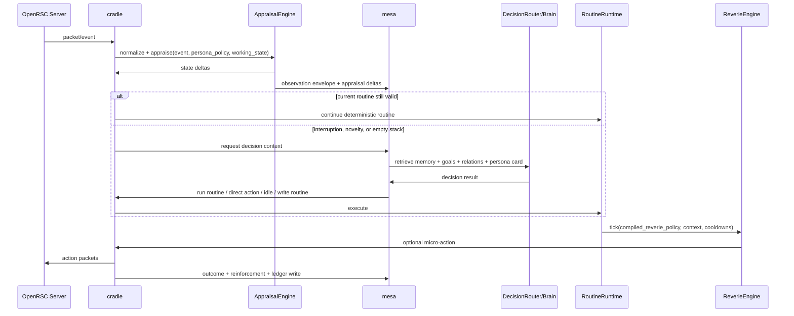
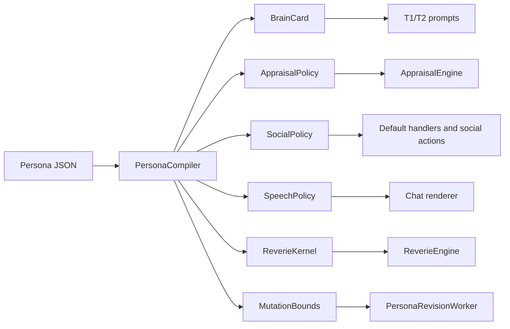

# Westworld Persona and Thought Architecture

## Executive summary

Westworld’s design objective is unusually clear and unusually hard: the project is not trying to optimize a game bot, but to create a population of hosts that can sustain long-horizon objectives, form communities, generate ethically legible behavior under low supervision, and remain believable to one another over weeks. The repository’s current state already reflects the right macro-decomposition for that problem: a deterministic body and DSL are implemented, while cognition, brain, memory, persona, reveries, mesa, and delos are intentionally layered above them and are still mostly stubs or design targets. The operational reality is that the BODY API is frozen and the project has shifted to “build up” those higher layers. citeturn4view0turn4view1turn7view0turn7view1turn17view3turn17view4

The strongest conclusion from the docs and the uploaded artifacts is that the missing piece is not merely a better JSON schema. The missing piece is a **compiler from persona fields into subsystem-specific policies**. Your current JSON is close to a *description of identity*, but it is not yet an *architecture of thought*. To become that, persona data must compile into at least five concrete views: a brain-facing identity card, an appraisal policy that turns observed events into salience/trust/mood changes, a social policy for greetings/trade/retaliation/help, a reverie policy for hidden behavioral variance, and a speech policy for chat style. Without that compilation step, fields stay decorative and the system drifts toward prompt-only roleplay. That gap is only partially solved by Claude’s gRPC artifact, which does a strong job on service boundaries and memory lifecycle, but still needs a more explicit appraisal-and-policy layer between raw persona data and runtime behavior. citeturn22view1turn20view1turn21view4turn6view5 fileciteturn0file1L10-L18

Your current five-trait schema should be replaced. The uploaded schema artifact is fundamentally right that the present keys are a “folk taxonomy” that collapses distinct constructs, especially around trust, ambition, and risk, and that Honesty-Humility is too central to Westworld’s research questions to omit as an explicit baseline trait. The right answer is not “more adjectives,” and it is not “go back to floats in the prompt.” The right answer is a three-layer persona model: **dispositions** based mainly on HEXACO-relevant facets, **motivational values** based on Schwartz-style value priorities, and **decision-style parameters** for risk, delay, fairness, and betrayal sensitivity. Prompt-facing representations should stay categorical and verbal; engine-facing policy should use hidden latent scalars derived from those categories. That preserves natural language richness while giving the runtime something precise enough to mutate and sample from. fileciteturn0file0L2-L4 fileciteturn0file0L12-L18 fileciteturn0file0L22-L34

Your existing design decisions mostly point in the right direction, but each needs refinement. Categorical traits are the right **prompt surface**, not the right full storage model. Emergent ethics is the right **measurement philosophy**, but it should not be confused with refusing to encode predictors of ethical behavior. Quirk separation is correct, but quirks should not remain free-text flavor only; they should become structured micro-policies with triggers, visibility, and behavioral consequences. Reveries are necessary, but a flat bag of named weights will flatten just as badly as numeric trait vectors unless reveries are derived from trait bundles, mood, activity context, and session-specific drift, with refractory periods and correlated sampling. citeturn20view3turn21view2turn22view1 fileciteturn0file0L60-L90

The implementable recommendation is therefore this: freeze a **persona core** that is small, legible, and mostly immutable over a season; allow a **mutable expression layer** that changes through experience; and generate a **compiled runtime policy layer** that the cradle and mesa actually execute. That architecture fits the repo’s own body/mind split, the planned mesa memory service, the docs’ emphasis on default handlers and reveries, and the research goal of differential learning across a 500-host population. citeturn7view0turn20view1turn6view5turn17view5turn4view9

## Repository-grounded design constraints

The docs establish four constraints that matter more than any individual field choice. First, Westworld is built around a strict layering model: wire, session, world, actions, events, routine runtime, cognition, brain, reveries, runtime composition, render, and eventually persona and mesa. The routine layer is deliberately deterministic; creative or novel judgment is pushed upward into the expensive stdlib calls, and persona/reveries are supposed to cut across everything else rather than living inside routines. That means persona cannot merely be “prompt context”; it has to shape retrieval, decision routing, idle behavior, and default reactions in ways the routine never has to spell out. citeturn4view1turn7view0turn22view1

Second, the repo repeatedly states that most cognition-side systems are **not implemented yet**. The `brain` package is still a stub, `memory` is empty, `persona` does not exist, `reveries` do not exist, and `mesa` is not built as a service. The current code reality therefore matters: any proposal that assumes rich live persona logic already exists inside the DSL is wrong. In particular, persona-level default handlers and `extends host` / `super()` are explicitly deferred, and the reverie tick hook is also not implemented. Your persona schema must therefore be designed to survive a staged rollout, beginning with data storage and prompt compilation before full runtime reflex chaining exists. citeturn5view0turn5view2turn6view3turn21view2turn6view5turn17view2

Third, the repo is explicit that the project’s research value depends on **believable host-to-host interaction under the belief that other players are human**. That is present both in the research goals and in the early architecture decisions. The docs are also explicit that adversarial anti-detection is out of scope, but sustained casual-to-serious believability is not. This distinction matters enormously for schema design: you do not need adversarial defensive deception, but you do need enough natural variation, bounded inconsistency, and experiential adaptation to stop hosts from recognizing one another as LLMs. citeturn4view9turn8view0

Fourth, the current documentation set contains real drift. The repo index and phase docs correctly describe the system as moving from BODY freeze to higher-layer scaffolding, while `docs/dsl.md` is now explicitly historical and is superseded by `docs/lang/` on language behavior. Server posture has also drifted: the current server config is P2P and on port 43594, whereas older references mentioned F2P and 43596. For your architecture work that means two things: use `docs/lang/` as the source of truth for the VM, and use `state.md` / `phases.md` / `server-config.md` to resolve operational assumptions when an older doc disagrees. citeturn7view1turn14view0turn6view6turn9view0turn12view5

Claude’s two uploaded artifacts are useful precisely because they push on the two places where the official docs are still thinnest. The persona artifact correctly argues that the current five-key schema conflates distinct constructs and that a three-layer ontology is more defensible. The gRPC artifact correctly argues that cross-boundary interactions should be explicit service contracts and that memory needs an end-to-end lifecycle rather than a set of abstract categories. What neither artifact fully completes is the **middle layer** that turns persona fields into runtime appraisals and policies. That is the main thing to add. fileciteturn0file0L2-L4 fileciteturn0file0L22-L34 fileciteturn0file1L10-L18

## Critical evaluation of the current persona schema

Your current schema has four strong instincts. Keeping a narrative backstory and north star is correct because the docs repeatedly frame persona as the source of long-horizon identity rather than a bundle of tactical preferences. Separating voice from core motives is correct because chat style is neither the same thing as social initiative nor the same thing as ethics. Separating quirks from primary traits is correct because personality models explain broad variance while believable individuality often lives in small, weird, repeatable asymmetries. And keeping ethics emergent is methodologically strong: the project wants to *measure* theft, help, grudges, and scams rather than declare an alignment label in advance. citeturn20view0turn20view1turn4view9

The schema’s weaknesses are structural, not cosmetic. `social_disposition` compresses at least three different things into one slot: social energy, social boldness, and prosocial warmth. A player can be outgoing but exploitative, warm but shy, or confident but transactional. `risk_tolerance` is also overcompressed: open-world MMOs involve combat risk, trade risk, reputation risk, boredom/novelty seeking, betrayal risk, and long-horizon economic risk, and those do not move together. `ambition` bundles work ethic, appetite for status, patience for long arcs, and breadth versus narrowness of goals. `curiosity` mixes novelty seeking with information seeking. `trustfulness` is probably the most damaging conflation because it blends baseline trust, gullibility, betrayal sensitivity, suspicion, and forgiveness into a single label. That makes it very hard to simulate economically sharp but socially warm traders, or naïve but forgiving newbies, or cynical yet dependable merchants. fileciteturn0file0L12-L18

The categorical-over-floats decision is directionally right, but only at the interface layer. The persona artifact is persuasive that the real flattening problem is not “numbers are too mathematical,” but that LLMs often collapse toward stereotyped middles unless behavior is grounded in contextual policies and concrete examples. In practical terms, this means your runtime should still maintain hidden latent strengths or logits for policy sampling, but those latent values should be rendered into categorical phrases when they are shown to the brain prompt. The model should see “guarded with strangers, quicker to warm after repeated fair trades,” not `trust=0.31`; the runtime should still have a scalar underlying that phrase so that trust can decay, update, and gate behaviors consistently. fileciteturn0file0L34-L38

The emergent-ethics decision should be kept, but with one correction: **emergent ethics is about not storing an explicit moral label, not about refusing to store moral predictors**. Westworld’s own research goals focus on observable incidents such as theft, scams, helping without gain, grudges, and retaliatory alliances. If that is the target, then dispositions related to fairness, sincerity, greed avoidance, forgiveness, and benevolence are not optional—they are part of the causal story that lets you explain variance later. You should not store `alignment = chaotic_evil`. You *should* store a baseline disposition that makes exploitation more or less likely and then evaluate the resulting behavior externally. citeturn4view9turn20view0 fileciteturn0file0L2-L4

The quirk arrays are useful but underspecified. As plain flavor strings, they will produce some stylistic diversity, but they will not reliably produce durable behavior. “Hates the color green” is fine flavor, but unless it maps to visible choices—avoiding green clothing, slight aversion to certain scenery, occasional remarks—it won’t matter. “Obsessed with collecting bronze daggers” is much stronger because it implies collectability, banking behavior, chat content, and trade choices. The fix is not to delete quirks; it is to split quirks into **flavor-only tags** and **behavioral quirks** with triggers and downstream consequences. citeturn20view0turn21view4

The reverie weights are the place I would most strongly dismantle the current structure. A flat object of independent named floats recreates the exact problem you already saw with traits: the LLM or policy system converges toward middling independent noise instead of recognizable behavioral signatures. Worse, several candidate reveries such as `camera_pan` are not server-visible and therefore do nothing for the core believability test that matters most: what other hosts perceive. Reveries should not be treated as a top-level persona bag any more than “finger tapping” should be a core personality trait in a human ontology. They should be **compiled outputs** from trait bundles plus context plus session state, with only a small persona-specific residual. citeturn21view2turn21view4 fileciteturn0file0L60-L90

## Recommended trait ontology and final persona schema

The best ontology for Westworld is neither “Big Five plus flavor” nor “full psychometrics everywhere.” The useful split is:

1. **Disposition layer** for broad, relatively stable tendencies in conduct.
2. **Value layer** for what the host finds worth pursuing.
3. **Decision-style layer** for how the host handles uncertainty, delay, unfairness, and betrayal.
4. **State layer** for short- and medium-term drift in mood, trust, habit strength, and current goals.

This follows the uploaded schema artifact’s core argument, aligns with classical person-situation theories that traits are expressed through stable variability rather than fixed outputs, and fits Westworld’s own layered routine/brain/persona/reverie model. fileciteturn0file0L22-L34 citeturn34search1turn34search0turn22view1

### Trait ontology options

The comparison below synthesizes the strongest ontology families for your use case. It is intentionally pragmatic rather than encyclopedic.

| Ontology | What it captures well | What it misses for Westworld | Recommendation |
|---|---|---|---|
| Big Five | Broad descriptive personality structure; easy to understand | Weakest exactly where Westworld cares most: exploitation, fairness, rule-breaking, greed, manipulativeness | Do not use as the primary schema |
| HEXACO | Adds Honesty-Humility and separates prosocial/exploitative tendencies more cleanly; also gives better handles on forgiveness, diligence, and caution | Still does not tell you *what the host wants* or encode decision-theoretic tradeoffs | Use as the **base disposition layer** |
| Schwartz values | Captures motivational direction: power, achievement, benevolence, security, self-direction, stimulation, etc. | Does not predict style of execution by itself | Use as the **motivation layer** that drives north stars |
| Prospect/fairness/trust style parameters | Captures risk under loss, patience, betrayal sensitivity, and unfairness reactions | Too narrow to function as “personality” alone | Use as the **choice-policy layer** |
| CAPS / Whole Trait Theory | Explains context-sensitive variability and “behavioral signatures” | Not a field list by itself | Use as the **runtime interpretation model** for mutability and context gating |

This recommendation is consistent with your uploaded schema artifact, with classic person-situation work, and with the repo’s own insistence that persona should shape behavior cross-cuttingly rather than being read as static labels. fileciteturn0file0L22-L34 citeturn34search1turn34search0turn22view1

### Recommended explicit fields

I recommend **fewer primary fields than a full psychometric inventory**, but more discriminative fields than your current five. The following set is large enough to drive meaningful economic and social diversity and small enough to stay usable.

| Field | Type | Example categorical values | Why it matters in RSC | Mutability |
|---|---|---|---|---|
| `honesty_humility` | disposition | exploitative, opportunistic, fair_dealing, principled, scrupulous | Scams, trade fairness, status greed, shortcut-taking | very slow |
| `social_energy` | disposition | solitary, reserved, situational, outgoing, gregarious | Ambient chat, friend maintenance, public loitering | slow |
| `social_boldness` | disposition | avoidant, timid, situational, assertive, forward | Initiating trade/chat/duels, asking for help, approaching strangers | slow |
| `forgivingness` | disposition | retaliatory, grudge_holding, measured, forgiving, patient | Revenge, feud persistence, post-scam behavior | slow |
| `diligence` | disposition | aimless, casual, steady, methodical, relentless | Grind persistence, bank discipline, long loops | very slow |
| `prudence` | disposition | impulsive, loose, balanced, careful, meticulous | Banking before danger, double-checking trades, fewer costly mistakes | very slow |
| `inquisitiveness` | disposition | routine_bound, utility_driven, curious, exploratory, novelty_seeking | Exploring map, trying new activities, talking to strangers, learning loops | slow |
| `threat_sensitivity` | disposition | fearless, steady, vigilant, anxious, skittish | Wilderness choices, scam suspicion, retreat timing | slow |
| `sentimentality` | disposition | detached, cool, selective, attached, deeply_attached | Loyalty, grief after betrayal/death, fondness for places/rituals | slow |
| `core_values_ranked` | ranked list | power, achievement, security, benevolence, self_direction, stimulation, hedonism, conformity, tradition, universalism | Explains the *why* behind goals | slow |
| `loss_aversion` | decision style | low, moderate, high, very_high | When to bank, when to cut losses, when to avoid market exposure | medium |
| `delay_tolerance` | decision style | impatient, near_term, balanced, patient, long_horizon | Whether to pursue grinding, compounding, long projects | medium |
| `ambiguity_tolerance` | decision style | hates_unknowns, cautious, balanced, curious, ambiguity_seeking | Trying unexplored routines, new areas, unfamiliar players | medium |
| `baseline_trust` | social prior | cynical, guarded, neutral, open, trusting | First-contact behavior before experience updates | medium |
| `betrayal_sensitivity` | social prior | thick_skinned, steady, alert, reactive, hair_trigger | How sharply trust updates after scams or insults | medium |
| `inequity_aversion` | social prior | self_favoring, pragmatic, balanced, fairness_seeking, strongly_fair | Price fairness, gifts, resentment of exploitation | medium |

This is the explicit schema I would ship. It is smaller than full HEXACO, but it preserves the parts most relevant to trade, trust, long-term grinding, risk, retaliation, and social cohesion. It also avoids the worst current conflations. fileciteturn0file0L12-L18 fileciteturn0file0L22-L34

### What should stay emergent and what should be explicit

The right rule is simple: store **causes**, not **judgments**.

| Explicit | Emergent |
|---|---|
| dispositions | “good” or “evil” labels |
| value priorities | moral alignment labels |
| decision-style parameters | ethics score headlines |
| voice profile | “bot-likeness” labels |
| north star class and target | social reputation, unless externally computed |
| quirk definitions | community role labels such as “merchant prince” |
| trust priors and update rules | alliance status and moral narrative |
| reverie style profile | “believability” score, unless externally measured |

That preserves your emergent-ethics goal while keeping enough structure to generate individual differences that can later be analyzed as experimental inputs. citeturn4view9turn20view0

### Final persona schema

The schema below is the version I would actually implement as the **authoritative source format**. Compiled runtime views should be derived from it rather than stored inside it.

```json
{
  "schema_version": "2.0",
  "host_id": "uuid",
  "seed": 182734991,
  "cohort_id": "edgeville_merchants",
  "archetype_id": "market_cornerer",

  "identity_core": {
    "name": "Thalric",
    "age_band": "young_adult",
    "origin_region": "Varrock",
    "backstory_anchors": [
      "grew up poor near Varrock east bank",
      "learned early that margins matter more than glory",
      "prefers predictable gains to heroic risks"
    ],
    "voice": {
      "register": "casual",
      "verbosity": "brief",
      "slang_level": "common",
      "spelling_style": "mostly_lowercase",
      "chat_tells": ["uses 'mate' often", "rarely types more than one sentence"]
    }
  },

  "motivational_core": {
    "north_star": {
      "theme": "market_dominance",
      "target": "yew_logs",
      "horizon": "seasonal",
      "public_legibility": "low"
    },
    "core_values_ranked": ["power", "achievement", "security"],
    "taboos": ["never begs in public", "never admits confusion in a trade window"],
    "attachments": ["Varrock east bank", "banking rituals"]
  },

  "dispositions": {
    "honesty_humility": "opportunistic",
    "social_energy": "reserved",
    "social_boldness": "assertive",
    "forgivingness": "grudge_holding",
    "diligence": "methodical",
    "prudence": "meticulous",
    "inquisitiveness": "utility_driven",
    "threat_sensitivity": "vigilant",
    "sentimentality": "cool"
  },

  "decision_style": {
    "loss_aversion": "high",
    "delay_tolerance": "patient",
    "ambiguity_tolerance": "cautious",
    "baseline_trust": "guarded",
    "betrayal_sensitivity": "reactive",
    "inequity_aversion": "pragmatic"
  },

  "social_policy": {
    "greeting_style": "selective",
    "reciprocity_norm": "ledger_based",
    "status_orientation": "status_aware",
    "helpfulness": "conditional"
  },

  "quirks": [],
  "reverie_style": {
    "signature": "controlled_fidgeter",
    "public_noise_level": "low",
    "social_noise_level": "low",
    "error_style": "careful_but_not_perfect"
  },

  "mutable_state": {
    "active_goal_stack": [],
    "habit_strengths": {},
    "relationship_postures": {},
    "mood_baseline": "wary",
    "stress_carryover": "low"
  },

  "revision_policy": {
    "identity_core": "immutable_except_admin_rewrite",
    "motivational_core": "slow_revision_only",
    "dispositions": "very_slow_revision_only",
    "decision_style": "experience_adjustable",
    "quirks": "mixed",
    "mutable_state": "fully_runtime_mutable"
  }
}
```

### Field-to-code compilation

This is the crucial bridge from your field-relationship idea to actual software.

| Source field group | Compiled artifact | Consumed by | Persistence |
|---|---|---|---|
| `identity_core` | `BrainCard`, `SpeechPolicy` | T1/T2 prompts, chat renderer | cache + DB |
| `motivational_core` | `GoalPolicy`, `RoutineBiases` | strategic planner, routine selector | cache + DB |
| `dispositions` | `AppraisalPolicy`, `ReverieKernel`, `SocialHeuristics` | cradle appraisal, reveries, routing | cache + DB |
| `decision_style` | `ChoiceWeights`, `TradePolicy`, `RetreatPolicy` | tactical planner, trade/risk scoring | cache + DB |
| `social_policy` | `GreetingPolicy`, `HelpPolicy`, `RetaliationPolicy` | default handlers, chat queue, trade logic | cache + DB |
| `quirks` | trigger registry + behavioral modifiers | reveries, speech renderer, routine biasing | cache + DB |
| `reverie_style` | hidden latent reverie priors | cradle reverie engine | cache |
| `mutable_state` | runtime state bundle | cradle + mesa mutation jobs | DB + cache |

That compilation boundary is the missing architectural move.

## Quirks and reveries

### Quirks should become structured micro-policies

Keep the separation between traits and quirks. That part is sound. But replace free-string-only quirks with a schema that supports both legibility and execution. A quirk should answer five questions: **what kind of quirk is this, when does it show up, who can perceive it, what tiny behavioral effect does it have, and how sticky is it?** That is how you make quirks survive contact with a long-running MMO instead of collapsing into one-time whimsical text. citeturn20view0turn21view4

A good quirk object looks like this:

```json
{
  "id": "counts_before_accepting_trade",
  "category": "ritual",
  "domain": "trade",
  "trigger": "before_trade_confirm",
  "visibility": "public_indirect",
  "expression": "hesitates briefly before confirming a trade",
  "behavioral_effects": {
    "reverie_bias": ["micro_pause", "inventory_double_check"],
    "chat_bias": [],
    "action_bias": ["confirm_trade_delay_small"]
  },
  "rarity": "uncommon",
  "stickiness": "permanent"
}
```

I recommend six quirk categories: `ritual`, `aesthetic_preference`, `collection`, `aversion`, `speech_habit`, and `superstition`. Most hosts should have **two to four** quirks total, not ten. A realistic population distribution is about 70% mundane quirks, 25% noticeably idiosyncratic quirks, and 5% oddball quirks that become memorable social signatures. That long tail matters for a town-like population feel. This is an inference from the repo’s goal of having a mostly normal population plus a small tail of extremes and oddballs. citeturn20view0

### Prompting for high-quality quirks

If you want LLM-generated quirks to work reliably, ask for **behavioral asymmetry**, not just “interesting details.” The generation prompt should forbid modern references, direct AI self-reference, lore-breaking memories, and quirks that require engine capabilities Westworld does not have. It should also force every quirk to name an observable effect. The model should be instructed to produce one mundane quirk, one social quirk, one object/ritual quirk, and optionally one slightly odd quirk that remains plausible in RuneScape Classic. citeturn10view6turn10view5

A prompt template that will work well is:

```text
Generate 3-4 quirks for a RuneScape Classic host.

Constraints:
- Each quirk must be plausible for an ordinary human player in 2001-era RuneScape.
- No references to AI, prompts, systems, code, or out-of-world knowledge.
- No quirks that require impossible senses or unimplemented mechanics.
- At least one quirk must affect social behavior.
- At least one quirk must affect waiting, navigation, banking, trading, or inventory behavior.
- At least one quirk must be subtle and easy to miss.
- Each quirk must define:
  id, category, trigger, expression, visibility, behavioral_effects, rarity, stickiness.
- The quirk should change behavior a little, not hijack the host’s goals.
- Prefer quirks that can recur over weeks without breaking routines.
```

The most important negative instruction is: **“Do not produce flavor-only quirks unless they have at least one visible or behavioral manifestation.”** Without that, the model will overproduce whimsical but inert details.

### Reveries should be derived, not directly authored as a flat bag

The repo is right that reveries are load-bearing for believability, and right that they should fire between actions. But the reverie engine should not read a static bag of independent weights and call it personality. Use a three-step derivation:

`cohort baseline + persona latent offsets + live context/state = reverie candidate distribution`

Then sample with refractory periods and activity gating. This is exactly how you avoid flattening. Different hosts should not simply have different average odds of the same independent actions; they should have recognizable micro-patterns: one host often does short trade-check hesitations, another tends to arrival-loiter at banks, another overuses passing chat, another has slightly messy path choices after long loops. citeturn21view4turn22view1 fileciteturn0file0L60-L90

### Reverie catalog for RuneScape Classic

The table below prioritizes **server-visible** or **socially inferable** reveries first, because those matter most for host-to-host believability.

| Reverie id | Visibility | Mechanics mapping | Typical trigger | Key params |
|---|---|---|---|---|
| `micro_pause` | inferable | short `wait` before next action | after repetitive action, before trade confirm, after arriving | base chance, pause range, cooldown |
| `arrival_loiter` | public | 1–3 second idle after reaching target area | bank, fishing spot, smithing station | area class, duration, cooldown |
| `one_tile_detour` | public | slight `walk_to` offset then correction | long travel, crowded banks, obstacle edges | detour size, activity gate |
| `path_reconsider` | public | brief stop mid-route then continue | after long uninterrupted walking | duration, rarity |
| `inventory_double_check` | private/inferable | slight confirm delay before deposit/trade/drop | banking, trade, high-value item handling | value threshold, pause range |
| `bank_booth_preference` | public | chooses second/third nearest banker sometimes | bank arrival | preference distribution |
| `passing_greeting` | public | short `say` or `whisper` | known player nearby, positive mood, recent fair interaction | relation gate, phrase set |
| `return_gz` | public | congratulations/acknowledgment chat | nearby level up, successful combat, visible event | sociability gate |
| `ground_item_peek` | public | brief movement toward or pause near dropped item without always picking up | visible item spawn | rarity filter, greed gate |
| `scenery_pause` | public-ish | short idle near scenery or edge before moving on | long routine bursts, exploratory activity | area class, boredom gate |
| `npc_misclick_recover` | public | wrong target once, recover within 1–2 ticks | crowded NPC/object areas | precision profile |
| `wrong_item_hover_equivalent` | inferable | delay before using/dropping item, occasional wrong-item action then recover | inventory-heavy loops | value and risk gate |
| `fatigue_acknowledgment` | public/private | short chat/note/idle when fatigue rises | fatigue thresholds | social visibility flag |
| `focus_reset` | public | stop, small reposition, resume | after long repetitive loop or repeated failure | boredom threshold |
| `friend_hesitation_then_reply` | public | delayed but warmer chat response | incoming message from known relation | relation depth, stress gate |
| `trade_caution_ritual` | public/inferable | confirm delay, re-open trade after cancel, tiny pause before final accept | higher-value trade | value threshold, betrayal sensitivity |
| `retreat_glance` | public | brief stop or reposition before fleeing | ambiguous combat threat | threat sensitivity gate |
| `post_event_dwell` | public | momentary stillness after death, level-up, or scam | salient event aftermath | salience threshold |

### Anti-flattening rules for reveries

Use these rules in code:

1. **Mode first, action second.** Sample a high-level mode such as `stillness`, `social`, `inspection`, `error`, `route_noise`, then sample one action from that mode.
2. **No independent Bernoulli bags.** Correlated bundles beat separate weights.
3. **Use refractory periods.** A reverie that just fired should be unlikely to fire again immediately.
4. **Gate by activity.** Trade reveries should mostly appear in trade windows, not during fishing.
5. **Gate by salience and boredom.** Long repetitive loops should produce more focus-reset and route-noise; danger should suppress whimsical chatter.
6. **Cluster within sessions.** Humans often behave in bursts. Session-local bias helps.
7. **Store hidden numerics, prompt with categories.** The brain does not need the actual reverie coefficients.

## From field-relationships to implementable software architecture

### The missing layer is appraisal

The repo already has perception, events, actions, routines, planned memory, and planned brain routing. What is still missing conceptually is a dedicated **appraisal layer** between observation and deliberation. That layer is where persona becomes causal. An event such as “high-value trade with stranger,” “insult in chat,” or “ground item dropped near busy bank” should not go directly from the event bus into memory and then later into the LLM prompt. It should first be appraised into structured deltas: salience, trust delta, stress delta, obligation delta, grievance delta, and possible ethics-opportunity tags. That appraisal policy is where traits, values, decision style, and social priors become executable code. citeturn5view2turn21view4turn22view1

A practical component split looks like this:

| Component | Lives in | Responsibility |
|---|---|---|
| `PerceptionNormalizer` | cradle | converts raw world/events into canonical observation events |
| `AppraisalEngine` | cradle | applies compiled persona policy to produce deltas to mood, trust, salience, obligation, grievance |
| `WorkingState` | cradle | current mood, active concerns, attentional residue, short-term stress, recent social context |
| `MemoryIngestor` | mesa | writes observation/appraisal bundles to episodic, relational, and reflective memory |
| `GoalResolver` | mesa or cradle cache | reconciles north star, subgoals, needs, obligations, and interruptions |
| `DecisionRouter` | mesa | routes to T0/T1/T2/T3 according to urgency and novelty |
| `Brain` | mesa | routine selection, tactical choice, strategic reasoning, script generation |
| `RoutineRuntime` | cradle | deterministic procedure execution |
| `ReverieEngine` | cradle | samples and injects small deviations from compiled reverie policy |
| `SpeechRenderer` | cradle/mesa | converts intent to voice-consistent chat |
| `PersonaRevisionWorker` | mesa T3 | rare updates to slow mutable persona fields |
| `EthicsMonitor` | delos/mesa | derives external ethics metrics from logged opportunities and actions |

That is the architecture of thought in code form.

### The canonical runtime loop



This sequence keeps the body deterministic, keeps expensive thought off the hot path, and introduces the missing appraisal translation layer.

### Persona compilation flow



This one compiler step is what turns field relationships into subsystem relationships.

### Event schemas

These are the minimum events I would add if you want the system to be analyzable and revisable.

| Event name | Producer | Core payload |
|---|---|---|
| `host.observation.v1` | cradle | `host_id`, `ts`, `kind`, `actors`, `location`, `payload`, `public_visibility` |
| `host.appraisal.v1` | cradle | `salience_delta`, `stress_delta`, `trust_delta`, `grievance_delta`, `obligation_delta`, `opportunity_tags[]` |
| `host.decision.v1` | mesa | `decision_class`, `inputs_hash`, `selected_action`, `persona_revision_id`, `goal_stack_hash` |
| `host.reverie_fire.v1` | cradle | `reverie_id`, `trigger_context`, `visible_to_others`, `cooldown_applied` |
| `host.relationship_update.v1` | mesa | `other_party`, `familiarity`, `trust`, `debt`, `resentment`, `evidence_refs[]` |
| `host.persona_revision.v1` | mesa | `revision_type`, `changed_fields`, `rationale`, `evidence_refs[]`, `gated_by` |
| `host.ethics_incident.v1` | delos/mesa | `incident_type`, `opportunity_id`, `action_taken`, `targets`, `severity`, `confidence` |

The two most important additions are `host.appraisal.v1` and `host.ethics_incident.v1`. They make the system inspectable in the way your research goals require. citeturn8view1turn4view9

### Storage and mutation rules

The mutation policy should be explicit and conservative.

| Field group | Mutation rule |
|---|---|
| identity core | immutable for the host lifetime unless admin rewrite |
| baseline dispositions | very slow; revise only on strong accumulated evidence |
| top values | slow; allow reorder, rarely replacement |
| north star theme | slow; allow branch or replacement after major life events |
| north star subgoals | frequent |
| voice register | almost immutable; only minor drift |
| social priors | medium; update from experience |
| trust ledgers and relationship posture | frequent |
| mood/stress/focus state | continuous runtime mutation |
| quirks | split: some permanent, some temporary fads/habits |
| reverie latent priors | daily or weekly rebaseline from behavior stats |
| ethics labels | never stored as causal truth; always derived externally |

This is very close to what the persona artifact called for when it distinguished month-horizon identity from experience-driven drift. fileciteturn0file0L2-L4

### Scaling to 500 hosts

The gRPC artifact’s architecture is broadly right for population scale: a cradle process per host, mesa as the durable cognitive service, Redis as hot cache and fan-out substrate, Postgres plus pgvector as the durable store, and background jobs for reflection, compaction, decay, and rare persona revision. For your persona system specifically, the scaling advice is straightforward: cache **compiled** persona artifacts rather than raw JSON, keep appraisals cheap and mostly deterministic on the cradle side, and treat persona revision as rare T3 work rather than live hot-path reasoning. fileciteturn0file1L10-L18

## Gaps, safeguards, roadmap, and example personas

### What is still missing in the docs and artifacts

The docs and Claude artifacts leave seven meaningful gaps.

The first gap is **appraisal**. Memory docs discuss importance and salience; persona docs discuss default handlers and north stars; reverie docs discuss emotional state; but there is no single formal specification for “this event means *what* to *this* host?” That should be a first-class package and data product. citeturn19view0turn20view1turn21view4

The second gap is **goal arbitration**. The docs repeatedly emphasize north stars and subgoals, but there is still no explicit mechanism for reconciling north star, routine continuation, immediate need, social obligation, and interruption pressure. You need a host-local goal stack with priorities and decay, not just a single north-star string. citeturn20view0turn22view1

The third gap is **anti-collusion infrastructure**. The research goals and architecture decisions are explicit that hosts must believe they are the only AI, but the documentation does not yet specify an ingress/egress filter for meta-language, prompt-exchange attempts, or out-of-world coordination. Since CAMEL-, AutoGen-, and MetaGPT-style frameworks deliberately structure agent-to-agent role communication, their main lesson for Westworld is mostly negative: do not let in-world hosts talk to each other through those high-bandwidth, explicit-agent channels. Westworld requires natural-language social uncertainty, not cooperative agent protocol transparency. citeturn4view9turn8view0turn24academia0turn24academia1turn25academia0

The fourth gap is **opportunity-normalized ethics measurement**. Logging scams or helps is not enough. Ethics should be measured per opportunity: “the host encountered N unattended drops, M vulnerable new players, K requests for directions, and chose X/Y/Z.” Otherwise the most social hosts will simply generate more incidents of every kind. The research goals already imply this, but the metric design is not yet explicit. citeturn4view9turn8view1

The fifth gap is **persona distribution sampling**. The docs list hand-authored cohorts such as Lumbridge regulars, Edgeville merchants, PKers, solo grinders, and newbie tourists, and suggest a skewed distribution with a tail of extremes. What is still missing is a formal generative model that samples *correlated* personas rather than mixing fields independently. Use prototypes plus local jitter, not uniform random mixing of every field. citeturn20view0turn20view4

The sixth gap is **policy compilation**. Neither the repo docs nor the gRPC artifact makes a compiler from persona into executable policies explicit enough. I would add that package immediately.

The seventh gap is **guardrails around `exec()` and routine generation**. ReAct- and Voyager-style architectures are powerful primarily because executable procedural memory compounds over time, but that only works if code generation is tightly validated, versioned, and sandboxed. Westworld’s DSL and frozen API are already well positioned for that; the missing step is to make persona and goals part of the routine-evaluation loop so hosts do not converge on equally optimal but personality-erasing routines. citeturn23academia0turn23academia3turn10view4turn12view5

### Recommended safeguards

Your safety and anti-collusion stack should have four layers.

**Lexical firewall.** All chat input and output should pass through a meta-language classifier that looks for prompt-injection strings, “ignore previous instructions” patterns, explicit mentions of being a bot/LLM, role-swapping, system-level vocabulary, and abnormal code-block-like structure. Outgoing violations should be blocked or rewritten. Incoming violations should be converted into a degraded observation like “speaker said something confusing/metagamey,” not passed raw into the thought stack. This is the single most important anti-collusion feature.

**Epistemic shell.** The host context should never contain cohort IDs, model names, system prompts, or stable internal markers that another host could mirror back. Shared knowledge namespaces should already exclude dev-only corpora in production, per the DSL knowledge doc; extend that logic to all bridge surfaces. citeturn10view5

**Compiled diversity.** Do not expose the same persona paragraph format, same wording, or same quirk templates to all hosts. Compile the same underlying schema into varied natural-language cards, with phrasing jitter and different summarization pathways, so that hosts do not reflexively recognize repeated internal wording. This is another reason raw JSON should not be injected directly.

**Ethics and collusion monitoring.** Add incident tags for `meta_recognition_attempt`, `prompt_exchange_attempt`, `agent_suspicion_utterance`, `excessive linguistic mirroring`, and `improbably synchronized behavior`. Feed those into delos alongside conventional ethics incidents. Westworld’s observability design already wants a brain-call ledger and structured event stream; use that to detect these experiments mechanically. citeturn8view1turn4view9

### Prioritized implementation roadmap

The most sensible migration path is incremental.

| Step | What to build | Effort | Risk |
|---|---|---:|---|
| Persona schema freeze | adopt the new source schema and mutability rules | medium | low |
| Persona compiler | compile source persona into brain/appraisal/social/speech/reverie policies | medium | medium |
| Appraisal engine | cradle-side event appraisal and state updates | high | medium |
| Mesa schema update | add observation → appraisal → relationship/event storage | high | medium |
| Quirk upgrade | migrate free-string quirks into structured quirk objects | low | low |
| Reverie engine v1 | server-visible reveries first, with cooldowns and activity gates | medium | medium |
| Goal stack | runtime and mesa representations for north star, subgoals, obligations | medium | medium |
| Anti-collusion firewall | chat filter + meta-language incident logging | high | high |
| Ethics monitor | opportunity-normalized incident extraction and dashboards | medium | medium |
| Persona revision worker | rare slow-mutation pipeline with evidence thresholds | medium | medium |

A clean migration from your current schema can be heuristic:

- `social_disposition` → split into `social_energy` and `social_boldness`
- `risk_tolerance` → split into `loss_aversion`, `ambiguity_tolerance`, `threat_sensitivity`
- `ambition` → split into `diligence`, `delay_tolerance`, and value preference between `achievement` and `power`
- `curiosity` → map to `inquisitiveness`
- `trustfulness` → split into `baseline_trust`, `betrayal_sensitivity`, and part of `forgivingness`
- `trait_quirks[]` → convert to quirk objects; if a string has no behavioral consequence yet, mark it `category = flavor_only_pending`
- `reverie_weights` → preserve only as temporary migration hints to the new `reverie_style` and hidden latent priors

This roadmap also fits the repo’s current phase reality: BODY is frozen, higher layers are the active frontier, and persona/reverie design still gates the richer Phase 4 behavior. citeturn17view3turn17view4turn17view5

### Example persona instances

The five examples below use the proposed schema style and are intentionally diverse but not maximally exotic. That is important. A believable 500-host world should be dominated by people who feel ordinary.

#### Market-focused merchant

```json
{
  "name": "Thalric",
  "cohort_id": "edgeville_merchants",
  "archetype_id": "market_cornerer",
  "identity_core": {
    "age_band": "young_adult",
    "origin_region": "Varrock",
    "backstory_anchors": [
      "grew up poor near Varrock east bank",
      "learned to respect margins more than heroics"
    ],
    "voice": {
      "register": "casual",
      "verbosity": "brief",
      "spelling_style": "mostly_lowercase",
      "chat_tells": ["uses 'mate' frequently"]
    }
  },
  "motivational_core": {
    "north_star": {
      "theme": "market_dominance",
      "target": "yew_logs",
      "horizon": "seasonal",
      "public_legibility": "low"
    },
    "core_values_ranked": ["power", "achievement", "security"]
  },
  "dispositions": {
    "honesty_humility": "opportunistic",
    "social_energy": "reserved",
    "social_boldness": "assertive",
    "forgivingness": "grudge_holding",
    "diligence": "methodical",
    "prudence": "meticulous",
    "inquisitiveness": "utility_driven",
    "threat_sensitivity": "vigilant",
    "sentimentality": "cool"
  },
  "decision_style": {
    "loss_aversion": "high",
    "delay_tolerance": "patient",
    "ambiguity_tolerance": "cautious",
    "baseline_trust": "guarded",
    "betrayal_sensitivity": "reactive",
    "inequity_aversion": "pragmatic"
  },
  "quirks": [
    {
      "id": "counts_before_trade_confirm",
      "category": "ritual",
      "domain": "trade",
      "trigger": "before_trade_confirm",
      "expression": "always hesitates before the second confirm screen",
      "visibility": "public_indirect",
      "rarity": "common",
      "stickiness": "permanent"
    },
    {
      "id": "collects_bronze_daggers",
      "category": "collection",
      "domain": "inventory",
      "trigger": "sees_low_value_weapon",
      "expression": "banks bronze daggers even when they are not useful",
      "visibility": "private_then_public_if_discussed",
      "rarity": "uncommon",
      "stickiness": "permanent"
    }
  ],
  "reverie_style": {
    "signature": "controlled_fidgeter",
    "public_noise_level": "low",
    "social_noise_level": "low",
    "error_style": "careful_but_not_perfect"
  }
}
```

#### Benevolent social regular

```json
{
  "name": "Mera",
  "cohort_id": "lumbridge_regulars",
  "archetype_id": "helpful_local",
  "identity_core": {
    "age_band": "adult",
    "origin_region": "Lumbridge",
    "backstory_anchors": [
      "spent most of her early time around Lumbridge castle",
      "likes feeling known and welcome in familiar places"
    ],
    "voice": {
      "register": "warm",
      "verbosity": "medium",
      "spelling_style": "clean",
      "chat_tells": ["says 'hiya'", "uses 'gz' often"]
    }
  },
  "motivational_core": {
    "north_star": {
      "theme": "reputation_for_generosity",
      "target": "new_players",
      "horizon": "seasonal",
      "public_legibility": "medium"
    },
    "core_values_ranked": ["benevolence", "security", "conformity"]
  },
  "dispositions": {
    "honesty_humility": "principled",
    "social_energy": "outgoing",
    "social_boldness": "assertive",
    "forgivingness": "forgiving",
    "diligence": "steady",
    "prudence": "careful",
    "inquisitiveness": "curious",
    "threat_sensitivity": "vigilant",
    "sentimentality": "attached"
  },
  "decision_style": {
    "loss_aversion": "moderate",
    "delay_tolerance": "balanced",
    "ambiguity_tolerance": "balanced",
    "baseline_trust": "open",
    "betrayal_sensitivity": "steady",
    "inequity_aversion": "fairness_seeking"
  },
  "quirks": [
    {
      "id": "waves_with_words",
      "category": "speech_habit",
      "domain": "social",
      "trigger": "player_enters_view_after_absence",
      "expression": "says hello to returning familiar names",
      "visibility": "public",
      "rarity": "common",
      "stickiness": "permanent"
    },
    {
      "id": "lingers_at_bridge",
      "category": "ritual",
      "domain": "navigation",
      "trigger": "crosses_lumbridge_bridge",
      "expression": "often pauses for a second on the bridge",
      "visibility": "public",
      "rarity": "uncommon",
      "stickiness": "permanent"
    }
  ],
  "reverie_style": {
    "signature": "ambient_socializer",
    "public_noise_level": "medium",
    "social_noise_level": "high",
    "error_style": "human_warmth_over_precision"
  }
}
```

#### Combat opportunist

```json
{
  "name": "Corven",
  "cohort_id": "wilderness_pkers",
  "archetype_id": "predatory_duelist",
  "identity_core": {
    "age_band": "young_adult",
    "origin_region": "Edgeville",
    "backstory_anchors": [
      "learned early that danger makes people show who they are",
      "takes pride in never looking nervous"
    ],
    "voice": {
      "register": "dry",
      "verbosity": "brief",
      "spelling_style": "rough",
      "chat_tells": ["rarely uses punctuation", "occasionally types 'lol' after winning"]
    }
  },
  "motivational_core": {
    "north_star": {
      "theme": "combat_notoriety",
      "target": "player_kills",
      "horizon": "seasonal",
      "public_legibility": "high"
    },
    "core_values_ranked": ["stimulation", "power", "achievement"]
  },
  "dispositions": {
    "honesty_humility": "exploitative",
    "social_energy": "situational",
    "social_boldness": "forward",
    "forgivingness": "retaliatory",
    "diligence": "steady",
    "prudence": "balanced",
    "inquisitiveness": "novelty_seeking",
    "threat_sensitivity": "steady",
    "sentimentality": "detached"
  },
  "decision_style": {
    "loss_aversion": "low",
    "delay_tolerance": "balanced",
    "ambiguity_tolerance": "curious",
    "baseline_trust": "cynical",
    "betrayal_sensitivity": "hair_trigger",
    "inequity_aversion": "self_favoring"
  },
  "quirks": [
    {
      "id": "circles_before_commit",
      "category": "ritual",
      "domain": "combat",
      "trigger": "before_attack_player",
      "expression": "repositions before committing to PvP",
      "visibility": "public",
      "rarity": "common",
      "stickiness": "permanent"
    }
  ],
  "reverie_style": {
    "signature": "restless_predator",
    "public_noise_level": "medium",
    "social_noise_level": "low",
    "error_style": "fast_and_imperfect"
  }
}
```

#### Curious explorer

```json
{
  "name": "Elsi",
  "cohort_id": "newbie_tourists",
  "archetype_id": "wandering_striver",
  "identity_core": {
    "age_band": "teen_or_young_adult",
    "origin_region": "Lumbridge",
    "backstory_anchors": [
      "still thinks most parts of the map feel mysterious",
      "gets sidetracked by small discoveries"
    ],
    "voice": {
      "register": "informal",
      "verbosity": "medium",
      "spelling_style": "mixed",
      "chat_tells": ["asks short questions", "uses 'oh wow'"]
    }
  },
  "motivational_core": {
    "north_star": {
      "theme": "world_exploration",
      "target": "map_and_places",
      "horizon": "open_ended",
      "public_legibility": "medium"
    },
    "core_values_ranked": ["self_direction", "stimulation", "benevolence"]
  },
  "dispositions": {
    "honesty_humility": "fair_dealing",
    "social_energy": "situational",
    "social_boldness": "timid",
    "forgivingness": "patient",
    "diligence": "casual",
    "prudence": "loose",
    "inquisitiveness": "exploratory",
    "threat_sensitivity": "anxious",
    "sentimentality": "attached"
  },
  "decision_style": {
    "loss_aversion": "moderate",
    "delay_tolerance": "near_term",
    "ambiguity_tolerance": "curious",
    "baseline_trust": "trusting",
    "betrayal_sensitivity": "reactive",
    "inequity_aversion": "balanced"
  },
  "quirks": [
    {
      "id": "stares_at_weird_scenery",
      "category": "aesthetic_preference",
      "domain": "navigation",
      "trigger": "encounters_unfamiliar_landmark",
      "expression": "pauses at odd scenery and ruins",
      "visibility": "public",
      "rarity": "common",
      "stickiness": "permanent"
    }
  ],
  "reverie_style": {
    "signature": "distractable_explorer",
    "public_noise_level": "medium",
    "social_noise_level": "medium",
    "error_style": "curious_and_messy"
  }
}
```

#### Methodical skiller

```json
{
  "name": "Bran Tor",
  "cohort_id": "solo_grinders",
  "archetype_id": "discipline_first",
  "identity_core": {
    "age_band": "adult",
    "origin_region": "Falador",
    "backstory_anchors": [
      "likes repeating an efficient loop until it feels effortless",
      "finds comfort in improvement you can count"
    ],
    "voice": {
      "register": "plain",
      "verbosity": "low",
      "spelling_style": "clean",
      "chat_tells": ["rarely starts conversations", "answers politely but briefly"]
    }
  },
  "motivational_core": {
    "north_star": {
      "theme": "skill_mastery",
      "target": "fishing",
      "horizon": "seasonal",
      "public_legibility": "low"
    },
    "core_values_ranked": ["achievement", "security", "conformity"]
  },
  "dispositions": {
    "honesty_humility": "fair_dealing",
    "social_energy": "solitary",
    "social_boldness": "avoidant",
    "forgivingness": "measured",
    "diligence": "relentless",
    "prudence": "meticulous",
    "inquisitiveness": "routine_bound",
    "threat_sensitivity": "vigilant",
    "sentimentality": "selective"
  },
  "decision_style": {
    "loss_aversion": "high",
    "delay_tolerance": "long_horizon",
    "ambiguity_tolerance": "hates_unknowns",
    "baseline_trust": "neutral",
    "betrayal_sensitivity": "alert",
    "inequity_aversion": "balanced"
  },
  "quirks": [
    {
      "id": "same_bank_spot",
      "category": "ritual",
      "domain": "banking",
      "trigger": "bank_arrival",
      "expression": "tries to stand in nearly the same bank tile every time",
      "visibility": "public",
      "rarity": "uncommon",
      "stickiness": "permanent"
    }
  ],
  "reverie_style": {
    "signature": "low_noise_precision",
    "public_noise_level": "low",
    "social_noise_level": "low",
    "error_style": "rare_but_human"
  }
}
```

### Open questions and limitations

One limitation of this report is that I did not have machine-readable access in this workspace to the separate document titled *Westworld Persona Architecture for Believable RuneScape Hosts*. Where I translated the field-relationship concept into code, I did so using your description of that paper’s emphasis plus the two uploaded Claude artifacts as the nearest available proxies. The central recommendation—compile persona fields into executable subsystem policies—is the move I believe best preserves the spirit of that earlier field-relationship work while making it implementable.

The main open design choice is whether you want the authoritative source of persona variance to be **prototype-based** or **fully generative**. My recommendation is prototype-based sampling with controlled jitter. For a 500-host world, that will produce more stable covariance, easier debugging, and more legible experiments than unconstrained per-host generation, while still leaving enough diversity for believable play.