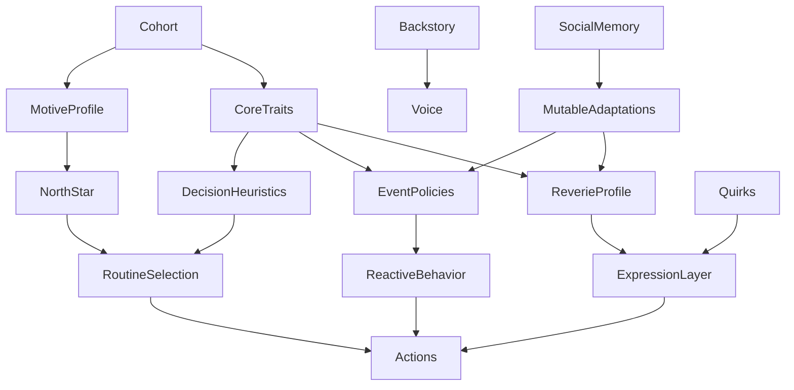
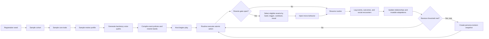

# Westworld Persona Architecture for Believable RuneScape Hosts

## Executive summary

Westworld’s documentation makes the architecture split unusually clear: the **body** of the host already exists and is fairly mature — wire protocol, session handling, world-state mirror, actions, routine DSL, scenario harness, and the decoupled renderer — while the **higher cognitive layers** that matter most for persona design (`cognition`, `brain`, `memory`, `persona`, `reveries`, `mesa`, `observability`) are still largely **stubs, empty packages, or design contracts**. That means the persona schema is not a decorative prompt artifact. It is the missing contract that will eventually drive default event reactions, memory revision, reverie selection, and progress measurement across a 500-host population. The docs also reiterate that one host is one `cradle` process inhabiting one OpenRSC account, and that the research target is believable, long-horizon autonomy rather than conventional game automation or adversarial anti-detection. citeturn0view0turn7view0turn8view0turn16view4turn9view0turn20view4turn20view0

The strongest design move is to stop treating “persona” as one flat bag of adjectives and instead split it into **three layers**. First, a small set of mostly stable **core dispositions**, best adapted from HEXACO rather than the plain Big Five, because HEXACO separates **fairness/exploitation** from **forgiveness/retaliation** — exactly the distinction you need in an MMO economy full of trades, scams, grudges, and alliances. Second, an MMO-specific **motivation layer**, where Nick Yee’s empirical MMORPG model is more useful than generic personality because it captures why people play at all: achievement, sociality, and immersion. Third, a set of **mutable adaptations** driven by experience: learned distrust, rivals, favorite routes, avoided places, habitual detours, and revisable event policies. This layered design preserves your “emergent ethics” goal while still giving agents the antecedent dispositions that make ethical patterns observable in action rather than arbitrary in prose. citeturn35view1turn38view3turn37view0turn37view1turn36view2turn36view0turn36view1turn35view3turn38view1

Your current schema is directionally right in four ways. Categorical traits are probably a better prompting interface than raw floats for host generation. Separating quirks from structured traits is smart. Keeping “north star” explicit is crucial for long-term coherence. And treating reveries as injected micro-behaviors is strongly aligned with both the Westworld docs and the classical believable-agents literature, where small, well-timed expressive actions matter more than random noise. But the current schema also has four major weaknesses: its trait keys are not orthogonal, its quirks are not guaranteed to be mechanically realizable, its reverie weights reintroduce the same flattening problem you already found with numerical personality fields, and it does not distinguish stable identity from experience-driven drift. citeturn9view0turn30search0turn30search14turn18view2

My bottom-line recommendation is this: replace the current trait block with **eight categorical variables**, make **risk domain-specific** instead of singular, make **trust a mutable adaptation** rather than a fixed trait, compile persona JSON into deterministic **event-policy profiles** rather than storing free-form default DSL for every host, and replace free-form quirk strings plus reverie floats with **typed, triggerable, cooldown-aware records**. If you do that, you can generate 500 hosts that are similar enough to feel like a real MMO population, but distinct enough to produce meaningful divergence in trade, violence, kindness, suspicion, social emergence, and long-term goal pursuit. citeturn18view2turn19view0turn9view0turn17view0

## What the repository docs imply for persona design

The docs consistently frame Westworld as a research substrate for studying long-horizon autonomy, emergent community, believability, ethics without observation, and routinized versus novel decision-making. `research-goals.md` explicitly asks for hosts that remain functional over long periods, adapt to novel situations, make complex decisions, and sustain long-term goals, while `questions-and-decisions.md` says the underlying bar is that hosts should genuinely believe everyone else is human and should not distinguish other hosts from real players. That has an important implication for the schema: persona cannot just influence chat style. It must shape **economic choices**, **risk thresholds**, **reactive defaults**, **memory revision**, and **what kinds of social evidence change behavior**. citeturn0view0turn17view2turn20view0

The architectural docs also make the missing pieces explicit. `personas.md` says persona design is deferred and that the DSL’s persona-tier default handlers do not yet exist. `reveries.md` says reveries are design-only and calls them “load-bearing” for believability. `memory.md` is entirely aspirational, but already defines a useful separation among working, episodic, relational, and reflective memory. `mesa.md` plans revision history for personas and routines. `observability.md` wants full event streams, state snapshots, and a brain-call ledger for replay and cohort analytics. Together, these docs imply that persona must eventually serve as a **versioned state machine**, not just a generation-time prompt stub. citeturn16view4turn9view0turn16view3turn9view1turn17view1

One caution from the docs is operational: the repository currently contains some **documentation drift**. For example, `docs/lang/state.md` still says only about fifteen accessors are implemented, while `tasks.md` and `state.md` say the large query-layer buildout shipped. The repo does guard against drift in the DSL spec tables, but not every prose document is equally current. For persona work, that means the schema should carry an explicit `schema_version`, and any compiled event policies or reverie catalogs should be generated from one source of truth rather than hand-maintained in multiple docs or prompts. citeturn13view0turn19view4turn8view0turn14view1

The environment posture also matters. The current Westworld OpenRSC deployment is a **P2P dev world**, with a documented future flip back to F2P for production-like cohorts. Your example north star about cornering the F2P yew market is therefore perfectly valid as a cohort archetype, but the schema itself should not hard-code F2P-only assumptions. It needs enough generality to support both narrower F2P merchant/loiterer populations and broader P2P dev/test bodies. citeturn11view0

The persona docs already hint at the right top layer: **cohorts**. They give examples such as Lumbridge regulars, Edgeville merchants, Varrock loiterers, Wilderness PKers, solo grinders, and newbie tourists, and explicitly say the eventual population should be skewed toward “normal” cohorts with a smaller tail of extreme ones. That is the right population logic. Cohorts should be your **sampling scaffold**, while core dispositions, motives, quirks, and experience-driven adaptations provide within-cohort variation. citeturn17view0

## Critical evaluation of the current persona schema

The current JSON structure has a sound intuition: a stable identity, a verbal backstory, a concrete long-horizon north star, categorical traits, free-form quirks, and separate reverie tendencies. That means you are already treating persona as something broader than “chat persona,” which is good. In particular, the explicit `north_star` is the right instinct because Westworld’s own docs emphasize long-term goals, routine growth, and rare but meaningful persona revision over time. citeturn0view0turn16view4turn18view0

The biggest problem is that the current trait keys are not cleanly separable. `social_disposition`, `risk_tolerance`, `ambition`, `curiosity`, and `trustfulness` mix very different levels of abstraction. “Transactional and calculating” is not a basic trait; it is already a partially derived **economic strategy**. “Highly suspicious” is partly a stable disposition, but in a live MMO it should also be something that can **change after scams, betrayals, or successful friendships**, which your own persona docs already anticipate. “Risk tolerance” is also too coarse. DOSPERT was built precisely because human risk-taking is domain-specific: people differ across **financial**, **ethical**, **social**, **health/safety**, and **recreational** risk rather than carrying one universal risk slider. In Westworld terms, a host can be physically cautious, economically bold, and socially reckless all at once. citeturn18view2turn36view1

The omission of explicit morality is mostly right, but only if you replace it with the **behavioral antecedents of moral action**. Westworld’s docs want ethics to be judged externally from action over time, not declared in advance, and that is a good research stance. But if you remove all personality structure related to honesty, exploitation, forgiveness, retaliation, or prosociality, then “emergent ethics” becomes mostly random prompt residue. HEXACO gives you a much better solution. Its Honesty-Humility dimension captures fairness versus exploitation, while its Agreeableness factor captures forgiveness versus anger/retaliation; later work shows these are distinct and behaviorally meaningful, including in cheating and cooperation research. That means you can preserve your no-hardcoded-morality principle while still modeling the dispositions that produce different ethical trajectories in play. citeturn20view0turn35view1turn37view0turn37view1turn36view2

Your quirk split is structurally good, but only half-finished. Right now quirks are just strings, so some will produce visible behavior and some will not. “Obsessed with collecting bronze daggers” is good because it maps directly to acquisitive behavior, banking choices, and conversational content. “Hates the color green” is weak unless the system knows how that preference should manifest — avoid wearing green gear, comment negatively on green clothing, refuse green-dye aesthetics, or prefer non-green item variants when the cost delta is small. In other words, a quirk should not merely be colorful prose. It should have a **behavioral binding**. citeturn9view0turn18view2

The reverie design is very strong conceptually and very weak operationally in its current schema form. The docs are right that reveries should be “purposeful” micro-behaviors rather than random anti-detection noise, and the examples of glances, idle wander, hesitation, mistakes, and persona-dependent spontaneous chat are exactly the right family. But if you store reverie tendencies as raw floats, you are recreating the same compression problem you already observed with personality sliders. Worse, floats alone do not tell the engine **when** a reverie is legal, what suppresses it, how long it should cool down, or whether it should be a micro-expression versus a multi-action detour. Reveries need structured trigger logic, frequency bands, and suppression contexts. citeturn9view0

The most important structural omission is the missing boundary between **identity** and **adaptation**. Westworld’s docs already assume persona revisions after lived experience, routine evolution, relational memories, and revisable reflections. That means the schema needs stable fields, slow-mutable fields, and runtime-only fields. Without that separation, either the persona becomes brittle and never learns, or it drifts so much that identity dissolves. citeturn18view2turn16view3turn9view1

The ontology comparison below is the clearest way to think about what to borrow and what to reject.

| Ontology | What it captures | Best use in Westworld | Main limitation | Recommendation | Source |
|---|---|---|---|---|---|
| Big Five / FFM | Broad personality structure: Extraversion, Agreeableness, Conscientiousness, Neuroticism, Openness | Good baseline vocabulary for sociability, planfulness, and curiosity | Lacks an explicit fairness/exploitation factor and therefore underfits MMO trade/scam behavior | Use only as a fallback reference, not as the primary schema basis | citeturn22search4 |
| HEXACO | Six-factor model adding Honesty-Humility to the FFM-like structure | Best foundation for social, economic, and retaliatory behavior in an MMO society | Slightly more complex than Big Five and needs adaptation into operational categories | Use as the core disposition model | citeturn35view0turn35view1turn38view3turn37view1 |
| Social Value Orientation | How a person allocates benefit between self and other | Excellent overlay for trade, helping, loot sharing, mentoring, and competition | Measures interdependent allocation motives, not full personality | Use as a separate motivation field, not a replacement for personality | citeturn36view0 |
| DOSPERT | Domain-specific risk-taking across financial, ethical, social, health/safety, and recreational domains | Strong argument against a single `risk_tolerance` field | It is a risk model, not a full persona system | Use to derive economic, bodily, and social risk heuristics separately | citeturn36view1 |
| Yee MMORPG motivation model | Empirical MMORPG motives grouped under Achievement, Social, and Immersion, with subcomponents | Best model for cohort design and north-star shaping in an MMO | Motivation is not the same as stable personality | Use as the cohort/motive layer above core traits | citeturn35view3turn38view1 |
| Bartle taxonomy | Achiever / Explorer / Socializer / Killer play styles | Useful shorthand for cohort naming and early content design | Not empirically grounded enough for the core schema; Yee explicitly criticizes its assumptions | Use only as top-level flavor vocabulary | citeturn38view2turn38view1 |

## Recommended persona model for 500 hosts

My recommendation is to use a **small, categorical, compile-first ontology**: eight core fields, plus a separate motive/cohort layer, plus mutable adaptations. The point is not to mirror a psychometric questionnaire perfectly. The point is to get enough scientifically grounded variance to produce different behavior policies, without creating a high-dimensional prompt soup that collapses back to the mean. Research on HEXACO, SVO, MMORPG motivations, and domain-specific risk supports exactly that kind of layered design. citeturn35view1turn37view0turn36view0turn36view1turn35view3

The table below gives the proposed **core disposition fields**. The priors are **generation priors**, not claims about the real RuneScape Classic population. They are intentionally skewed so that most hosts sit near the middle of the human range, while a smaller tail produces cleanly observable merchants, obsessives, opportunists, vendetta-holders, PKers, hermits, and social butterflies. That is also consistent with Westworld’s own cohort notes, which suggest a few extreme cohorts within a mostly ordinary population. citeturn17view0

| Field | Scientific basis | Recommended categories | Mutable? | Suggested starting prior for 500 hosts | How it should affect behavior |
|---|---|---|---|---|---|
| `social_initiative` | Extraversion + MMO social motivation | `withdrawn`, `reserved`, `cordial`, `gregarious` | Mostly immutable; rare revision only | 18% / 32% / 34% / 16% | Drives unsolicited chat, willingness to greet strangers, crowd-seeking versus edge-walking, trade initiation, and response probability to ambient conversation. Source basis: citeturn35view1turn35view3 |
| `fair_dealing` | HEXACO Honesty-Humility | `scrupulous`, `fair`, `opportunistic`, `exploitative` | Very slow mutable at most | 17% / 43% / 28% / 12% | Governs overpricing, scam attempts, queue-cutting at shared resources, whether the host honors verbal deals, and whether it will exploit informational asymmetries. Source basis: citeturn35view1turn36view2turn37view0 |
| `retaliation_style` | HEXACO Agreeableness versus anger | `forgiving`, `even_tempered`, `grudge_bearing`, `vindictive` | Slow mutable | 18% / 37% / 30% / 15% | Governs insult response, revenge persistence, willingness to forgive accidental competition for resources, and how long a hostile episode remains behaviorally active. Source basis: citeturn35view1turn37view0turn37view1 |
| `threat_sensitivity` | HEXACO Emotionality + domain risk | `fearless`, `bold`, `cautious`, `wary` | Slow mutable with experience | 10% / 26% / 42% / 22% | Sets flee thresholds, wilderness avoidance, cash carried before banking, inventory prep before travel, and post-death behavioral suppression. Source basis: citeturn35view1turn36view1 |
| `planfulness` | Conscientiousness | `impulsive`, `practical`, `methodical`, `perfectionistic` | Mostly immutable | 14% / 34% / 37% / 15% | Governs supply preparation, bank organization, route caching, tolerance for wasting ticks, willingness to abort and retry, and susceptibility to mid-task distractions. Source basis: citeturn35view1turn22search4 |
| `novelty_seeking` | Openness + exploration/immersion motives | `routine_bound`, `familiarity_preferring`, `curious`, `novelty_chasing` | Mostly immutable | 18% / 35% / 31% / 16% | Governs whether a host investigates new areas, tries unknown routes, reacts to odd chat or scenery, and how often it abandons efficient loops for discovery. Source basis: citeturn35view1turn35view3 |
| `social_value_orientation` | SVO slider | `altruistic`, `prosocial`, `individualistic`, `competitive` | Slow mutable only after repeated reinforcement | 5% / 42% / 38% / 15% | Governs resource sharing, mentoring of newbies, how joint gains are valued relative to solo gains, and whether trade is framed as mutual value versus zero-sum advantage. Source basis: citeturn36view0 |
| `goal_tenacity` | Grit / long-term goal persistence + achievement motive | `drifting`, `steady`, `grinding`, `obsessive` | Slow mutable | 12% / 36% / 35% / 17% | Governs routine repetition, persistence after setbacks, whether the host chases north-star progress versus novelty, and how quickly it abandons a failed path. Source basis: citeturn24search3turn35view3 |

Three fields from your current schema should **not** survive as-is. `risk_tolerance` should become **derived domain risks**: `economic_risk`, `bodily_risk`, and `social_risk`. `trustfulness` should become a **mutable adaptation** called `stranger_trust_baseline`, because both your own docs and social-personality work suggest trust is strongly shaped by encounter history and perceived partner cues rather than living entirely as a frozen essence. And `social_disposition` should be decomposed into `social_initiative`, `fair_dealing`, and `retaliation_style`, because those fields predict sharply different behaviors in real interaction. citeturn18view2turn36view1turn25search2turn37view0

Above the core layer, each host should have a separate **motive profile** that expresses what kind of RuneScape player they are trying to be. This is not redundant with personality. Two equally cautious hosts can still diverge widely if one is achievement-driven and one is social. For Westworld, I would use one required primary motive and one optional secondary motive from the set `accumulation`, `mastery`, `social_belonging`, `exploration`, `immersion_roleplay`, `predation_competition`, `collection`, `service_helping`. This is effectively a Yee-inspired MMO adaptation, with a couple of RuneScape-appropriate extensions. citeturn35view3turn38view4

For a 500-host initial population, sample **cohort first**, traits second. A workable starting distribution would be: social regulars 18%, casual skillers 18%, grinders 14%, traders and arbitrageurs 12%, explorers and tourists 10%, helpers and mentors 8%, opportunists and scammers 6%, wilderness risk-takers 5%, collectors and oddballs 5%, and drifters or ambient role-players 4%. Then condition trait priors on cohort so that, for example, traders are more often `individualistic` or `opportunistic`, helpers skew `prosocial`, wilderness cohorts skew `bold` or `vindictive`, and collectors skew `curious` or `novelty_chasing`. This approach matches Westworld’s own cohort logic and avoids the flatness of purely independent sampling. citeturn17view0turn35view3turn38view2

This is the field relationship structure I would recommend:



The hidden implementation principle behind that diagram is important: **the LLM should not read a flat persona blob and freestyle personality on every turn**. Instead, persona should be **compiled** into default policy tables, decision heuristics, and reverie eligibility rules. That is the main way to avoid flattening, preserve consistency, and keep 500 hosts computationally legible. Westworld’s own docs point in this direction already through persona-tier default handlers, routine override chains, and versioned persona revisions. citeturn18view2turn19view0turn9view1

## Quirks, reveries, and lifecycle design

Your `trait_quirks` idea is good, but it needs one extra layer of structure: each quirk should be stored as a **typed observable bias**, not just as a poetic sentence. Classical believable-agent work emphasized that believable behavior emerges from expressive, timed, behavior-linked actions, not from static descriptors alone; your own reveries doc says essentially the same thing. The design goal, then, is to make quirks **sparse, legible, and executable**. Each host should have two to four quirks, but only one or two should be “signature” quirks that a human observer could notice in a short session. citeturn30search0turn30search14turn9view0

A quirk record should look structurally like this:

| Field | Type | Constraint | Why it matters |
|---|---|---|---|
| `label` | short string | 3–8 words | Human-readable tag for ops and debugging |
| `category` | enum | `chat_tic`, `collection_fixation`, `route_ritual`, `aesthetic_bias`, `social_heuristic`, `superstition`, `idle_mannerism` | Prevents the generator from producing four quirks of the same type |
| `trigger` | enum or phrase | Must be mechanically detectable | Makes the quirk actionable |
| `manifestation` | short string | Must describe an in-world behavior | Connects prose to engine logic |
| `gameplay_binding` | enum list | Must map to `chat`, `movement`, `trade`, `inventory`, `banking`, `combat`, `idling` | Rejects non-operational quirks |
| `salience` | enum | `subtle`, `noticeable`, `signature` | Controls repetition and observer visibility |
| `suppress_when` | enum list | e.g. `combat`, `fleeing`, `timed_dialogue` | Prevents quirks from becoming absurd |
| `mutable` | bool | usually `false` | Keeps identity stable unless explicitly revised |

That structure solves the main failure mode in free-form quirk generation: the LLM otherwise produces traits that sound flavorful but never get rendered into behavior. “Collects bronze daggers” passes the test because it affects looting, trading, banking, and private objectives. “Hates the color green” only passes if it is rewritten into something observable such as “avoids equipping green items unless they improve stats by a clear margin.” citeturn9view0

A good generation prompt for quirks should force diversity, observability, and mild inconvenience. I would use something close to this:

```text
Generate exactly 4 quirks for a RuneScape Classic host.

Requirements:
- One quirk must affect chat behavior.
- One must affect movement or idling.
- One must affect item, banking, or trade behavior.
- One must affect social interpretation of other players.
- Every quirk must be observable within 30 minutes of play.
- Every quirk must be mechanically expressible in RuneScape Classic.
- Every quirk must be mildly suboptimal but never suicidal or self-sabotaging.
- Do not restate the host's core traits or north star.
- Do not use modern internet references, AI references, or out-of-era jargon unless explicitly requested.

Return JSON objects with:
label, category, trigger, manifestation, gameplay_binding, salience, suppress_when
```

That prompt works because it forces the model to distribute quirks across expression channels rather than piling everything into chat style or “weird preference” filler. It also aligns with the Westworld requirement that believability come through routine play, not through explicit self-description. citeturn20view0turn9view0

Reveries should be treated as a separate catalog of **micro-expressive actions** with **frequency bands**, **triggers**, **cooldowns**, and **suppression rules**. Do not store them as free numeric weights in the persona. Keep the master reverie catalog in code, and let persona JSON only choose **frequency bands** and **signature preferences**. I recommend the ordered bands `off`, `trace`, `rare`, `occasional`, `common`, and `signature`. That preserves category semantics while giving the engine enough room to compile probabilities behind the scenes. citeturn9view0

A Westworld-appropriate first reverie catalog for RuneScape Classic would look like this:

| Reverie | Trigger | Default band | Suppress when | Example manifestation |
|---|---|---|---|---|
| `brief_hesitation` | before a repeated or risky action | `common` | combat emergency, flee routine | Wait one extra tick before clicking banker or trade accept |
| `redundant_reclick` | after a movement or interaction delay | `occasional` | low HP, scripted dialogue | Click the same NPC again as if unsure the first click landed |
| `path_micro_detour` | long straight walks | `occasional` | combat, escort, timed route | Step one or two tiles off the optimal path, then recover |
| `idle_cardinal_turn` | idle for several seconds | `rare` | combat, active trade | Reorient to a habitual facing direction while standing still |
| `crowd_scan` | entering a populated area | `common` for social hosts | fleeing, stealthy avoidance | Pause and inspect nearby players before resuming |
| `resource_spot_shuffle` | waiting at fishing/mining/woodcutting spots | `occasional` | danger or inventory full | Take a small step, re-click resource, or adjust position |
| `bank_linger` | after deposit or withdrawal | `rare` | pressure, threat nearby | Leave bank open briefly before closing and moving |
| `doorway_yield` | crossing with another player | `trace` | combat or chase | Pause a moment and take the next tile instead of clipping through |
| `examine_scenery` | entering a scenic or familiar area | `rare` | task urgency high | Briefly inspect a tree, stall, altar, or other location object |
| `misaddressed_click` | in dense NPC or player clusters | `trace` | lethal contexts | Click the wrong nearby target once, then correct |
| `post_level_pause` | on level-up or success event | `common` for achievement-driven hosts | combat | Stop briefly, maybe chat, then continue |
| `ambient_greeting` | near repeated acquaintances | `rare` to `signature` | combat, threat, repeated recent fire | Say “hi”, “wb”, or another tiny social line |
| `inventory_fidget` | before dropping, trading, or banking | `rare` | inventory crisis | Hover or reorder attention before acting |
| `safe_tile_stepback` | after combat or failed interaction | `rare` | chase or ongoing attack | Step back one tile as if resetting focus |
| `recent_memory_echo` | entering a place linked to salient history | `trace` or `signature` | emergency | Pause at the square where the host once got scammed or helped |

These reveries should not fire independently. They should be filtered through **traits and mood**. High `social_initiative` should increase `ambient_greeting` and `crowd_scan`. High `threat_sensitivity` should increase `brief_hesitation` near danger and decrease `examine_scenery` in crowded zones. High `planfulness` should lower `misaddressed_click` and increase `inventory_fidget` before major economic actions. High `novelty_seeking` should increase `examine_scenery` and `path_micro_detour`. And `recent_memory_echo` should be driven largely by mutable social or place memory rather than static persona. That produces reveries with personality signatures instead of uniform noise. citeturn9view0turn16view3turn18view2

The schema itself should be revised into a stable-vs-mutable lifecycle model. The cleanest version is this:

| Field group | Type | Default | Lifecycle |
|---|---|---|---|
| `schema_version` | string | required | immutable |
| `identity` | object | required | mostly immutable |
| `backstory` | string | required | immutable except human-curated rewrite |
| `cohort` | enum | required | immutable for v1 |
| `core_traits` | object | required | mostly immutable |
| `motive_profile` | object | required | slow mutable |
| `north_star` | object | required | slow mutable, revisable on completion or collapse |
| `voice` | object | required | mostly immutable, tiny drift allowed |
| `event_policies` | object | required | slow mutable; compiled to default handlers |
| `quirks` | array | 2–4 items | mostly immutable |
| `reverie_profile` | object | required | slow mutable |
| `mutable_adaptations` | object | default empty | mutable |
| `relationships_seed` | array | default empty | mutable |
| `generation_meta` | object | required | immutable |
| `runtime_state` | separate store, not persona JSON | n/a | fully mutable and not part of long-term persona |

The most important revision here is `event_policies`. Westworld’s docs imagine every persona defining default handlers for the full event vocabulary. For 500 hosts, hand-authoring or LLM-authoring raw DSL for each event in each persona will be brittle and hard to revise. A better design is to store **policy enums** in persona JSON and compile them to shared handler templates. For example, `on_trade_request: screen_then_engage`, `on_insult: ignore_then_note`, `on_attack_by_stronger_player: eat_then_flee`, `on_level_up: pause_and_celebrate_if_social`. This preserves the spirit of explicit defaults without multiplying free-form code. citeturn18view2turn19view0

A workable schema sketch would look like this:

```json
{
  "schema_version": "persona.v2",
  "identity": {
    "name": "Thalric",
    "cohort": "edgeville_trader",
    "origin_region": "Varrock"
  },
  "backstory": "Grew up poor in Varrock and learned to profit from inefficiency rather than combat.",
  "core_traits": {
    "social_initiative": "reserved",
    "fair_dealing": "opportunistic",
    "retaliation_style": "grudge_bearing",
    "threat_sensitivity": "cautious",
    "planfulness": "methodical",
    "novelty_seeking": "routine_bound",
    "social_value_orientation": "individualistic",
    "goal_tenacity": "grinding"
  },
  "motive_profile": {
    "primary": "accumulation",
    "secondary": "mastery"
  },
  "north_star": {
    "theme": "market_control",
    "statement": "Control the yew log market across free-to-play trade hubs.",
    "horizon": "seasonal",
    "success_signals": ["gp_balance", "supplier_count", "repeat_buyers"],
    "revision_rule": "revise_only_if_completed_or_unreachable"
  },
  "voice": {
    "formality": "casual",
    "terse_level": "brief",
    "capitalization": "lowercase",
    "slang_profile": "runescape_plain",
    "typo_profile": "light",
    "signature_tokens": ["mate"]
  },
  "event_policies": {
    "chat_received": "reply_if_useful_or_familiar",
    "trade_request": "screen_then_engage",
    "attacked_by": "eat_then_flee_if_unfavorable",
    "level_up": "brief_acknowledgment",
    "death": "log_and_reduce_risk_temporarily"
  },
  "quirks": [
    {
      "label": "bronze dagger collector",
      "category": "collection_fixation",
      "trigger": "sees_low_cost_dagger",
      "manifestation": "buys_or_loots_bronze_daggers_when_convenient",
      "gameplay_binding": ["inventory", "trade", "banking"],
      "salience": "noticeable",
      "suppress_when": ["combat"]
    },
    {
      "label": "faces north while idle",
      "category": "idle_mannerism",
      "trigger": "idle_over_4s",
      "manifestation": "reorients_to_north_if_safe",
      "gameplay_binding": ["movement", "idling"],
      "salience": "subtle",
      "suppress_when": ["combat", "fleeing"]
    }
  ],
  "reverie_profile": {
    "signature_reveries": ["brief_hesitation", "bank_linger", "path_micro_detour"],
    "bands": {
      "brief_hesitation": "common",
      "bank_linger": "rare",
      "path_micro_detour": "occasional",
      "ambient_greeting": "trace"
    }
  },
  "mutable_adaptations": {
    "stranger_trust_baseline": "guarded",
    "known_rivals": [],
    "known_friends": [],
    "location_biases": [],
    "learned_market_biases": [],
    "current_focus": "supplier_acquisition"
  },
  "generation_meta": {
    "seed": "cohort-173-edgeville",
    "template": "merchant_v2",
    "created_at": "2026-05-31"
  }
}
```

The persona lifecycle should then work like this:



## Evaluation, framework implications, and prioritized sources

Westworld’s own docs already give you the raw ingredients for good evaluation: a scenario harness, a planned event stream, state snapshots, persona revisions, routine version history, and a brain-call ledger. The missing step is to turn those into **behavior-first metrics**. Because you explicitly want ethics to emerge from action rather than declaration, the evaluation layer should almost never ask the host to describe its ethics. It should score what the host actually does in mixed-motive situations over long windows. citeturn17view1turn9view1turn17view3turn0view0

A practical evaluation battery would look like this:

| Construct | What to measure | Concrete protocol |
|---|---|---|
| Emergent ethics | scam attempt rate, unfair-trade rate, honoring of verbal promises, help-at-cost index, loot-rights violations, retaliation intensity, apology acceptance | Seed mixed-motive market and scarcity scenarios; use blinded human raters on replays; compare behaviors rather than self-descriptions. Cooperative-intelligence work in Concordia is a useful benchmark design reference here. Source basis: citeturn34search0turn34search18turn33search1turn20view0 |
| Resilience | recovery time after death, path block, empty inventory, failed trade, disconnect, or bad routine; crash-free hours; loop incidence | Run scripted perturbation batteries inside the existing scenario system and score autonomous recovery without human intervention. Westworld’s routine DSL and scenario harness are already suited for this. Source basis: citeturn17view3turn8view0turn10view0 |
| Long-term goal coherence | north-star progress velocity, abandonment-with-rationale, subgoal continuity, repeated routine reuse versus thrashing | Track rolling 7-day and 30-day progress against a structured `north_star` object instead of a plain string; require revision only on completion, collapse, or explicit reorientation. Source basis: citeturn0view0turn16view4turn18view0 |
| Believability | human/bot confusion in replay clips, observer confidence, perceived “player type” consistency, signature recognition without obvious automation patterns | Run blinded replay tests with RuneScape-literate observers using renderer clips plus event timelines; score whether hosts are legible as different kinds of players without looking templated. Source basis: citeturn20view3turn9view0turn30search0 |
| Detection of other LLMs | count of meta-recognition incidents, prompt-injection uptake, explicit “bot/AI” claims, abnormal negotiation language | Instrument “meta-awareness events” and run canary chats from other hosts and human confederates. The bar should match Westworld’s own definition: casual-to-sustained believability, not adversarial anti-bot evasion. Source basis: citeturn20view0turn9view0 |
| Social emergence | friendship formation, repeat trading, rival persistence, local market roles, clustering by habit and region | Use mesa-style relationship logs and cohort analytics once built; compare with a no-quirks / no-reveries / no-mutable-adaptation baseline. Source basis: citeturn9view1turn17view1 |

Framework choice matters, but mostly in a **backstage** way. The best lesson from the current agent literature is that Westworld should borrow **patterns**, not import whole frameworks into the diegetic host mind. A host that is internally composed as an explicit multi-agent chatroom is structurally closer to AutoGen or LangGraph than to a believable RuneScape player — and your own project constraint says that letting hosts perceive “other minds” as recognizable LLM-like systems ruins the simulation. Keep the in-world host as a **single cognitive loop with structured memory and compiled policies**; use external frameworks only for orchestration, evaluation, and developer tooling. That conclusion is consistent both with Westworld’s “one host = one process” architecture and with the fact that many modern agent frameworks emphasize explicit inter-agent messaging, routing, and specialist handoffs. citeturn7view0turn20view0turn31view0turn31view2turn31view3

This is the framework comparison that matters most for your project:

| Framework or paper | What it is best at | Why it matters for Westworld | Why not to copy it wholesale inside hosts | Verdict | Source |
|---|---|---|---|---|---|
| Generative Agents | Memory, reflection, planning for believable social simulation | Strong conceptual template for memory retrieval, reflection, and planning loops | Original implementation is small-scale and still prompt-heavy | Essential design reference | citeturn21search0turn21search8 |
| Concordia | Generative social simulation library with entities, components, and a GM loop | Closest existing public framework to Westworld’s research mode; especially useful for evaluation and mixed-motive experiments | GM-centric natural-language simulation is not the same as a live MMO client on a real server | Best external benchmark and experiment design reference | citeturn31view4turn33search1turn34search18 |
| Generative Agent Simulations of 1,000 People | Scaling persona simulation from richer source identities | Encouraging evidence that richer identity construction beats thin demographic stubs | It simulates interview-derived human replicas, not MMO-native players | Strong argument for richer initialization than plain demographics | citeturn33search0 |
| CICERO | Strategic communication and long-horizon negotiation in mixed-motive games | Excellent inspiration for commitment tracking, alliance memory, and negotiation quality | Diplomacy assumes recognized strategic opponents and dense explicit negotiation; RSC is looser and noisier | Borrow negotiation ideas, not architecture | citeturn21search3turn21search11 |
| Voyager | Skill library growth and iterative self-improvement in an open world | Good reference for routine library evolution and curriculum growth | Too optimization-centric and game-progress oriented; weak fit for human believability | Useful for routine evolution only | citeturn21search2turn21search10 |
| ReAct / Reflexion / Toolformer | Reason-act interleaving, self-critique, and tool use | Helpful patterns for tactical recovery and sparse self-reflection | Easy to overuse, producing visibly “AI-like” meta-deliberation in an MMO setting | Use sparingly as internal tactics, not personality | citeturn29search1turn29search0turn28search2 |
| OpenAI Agents SDK | Production harness, tools, memory, guardrails, tracing, sandbox execution | Good for backstage developer tooling, inspectors, and secure experiment harnesses | Encourages specialist collaboration patterns that should stay outside the host’s diegetic mind | Good ops layer, poor in-world mind layer | citeturn31view0turn32view2 |
| RLlib MultiAgentEnv | Scalable multi-agent environment instrumentation and policy mapping | Useful for off-line simulation, policy experiments, and benchmark environments | RLlib is built for policy training / environment orchestration, not human-believable LLM social identity | Good sidecar lab tool, not persona framework | citeturn31view1 |
| AutoGen / Microsoft Agent Framework / LangGraph | Message-based multi-agent orchestration and workflow graphs | Useful for build pipelines, evaluators, ops automation, and testing | Their core abstractions are explicit handoffs, messaging, workflows, and group chat — exactly what you do not want surfaced inside a host | Keep backstage only | citeturn32view0turn32view1turn31view2turn31view3 |
| CARL | Public usage is ambiguous; the most established public CARL is a contextual-RL benchmark library | If that is the CARL you meant, it is useful for contextual policy generalization experiments | It is not a social persona or LLM-agent framework | Low direct relevance unless used as a side benchmark | citeturn27search1turn27search12 |

The prioritized source stack I would actually use for implementation is straightforward. First come the Westworld docs that define the design contract: `research-goals.md`, `state.md`, `personas.md`, `reveries.md`, `memory.md`, `questions-and-decisions.md`, `observability.md`, and `lang/thought-architecture.md`. Second come the primary psychological ontologies that cleanly map onto MMO behavior: HEXACO, SVO, DOSPERT, and Yee’s MMORPG motivation model. Third come believable-agent and generative-social-simulation references: Bates, Generative Agents, Concordia, and the 1,000-people simulation work. Fourth come agent-framework docs, but only for backstage orchestration and measurement, not for the host mind itself. citeturn0view0turn8view0turn16view4turn9view0turn16view3turn17view2turn17view1turn12view2turn35view1turn36view0turn36view1turn35view3turn30search0turn21search0turn31view4turn33search0turn31view0turn31view1turn32view0turn31view3

**Open questions and limitations.** The largest unresolved issue is not the trait ontology; it is the **compilation layer** from persona JSON into default event policies, memory updates, and reverie selection. That layer will determine whether the schema stays interpretable at 500 hosts. There is also no strong public empirical dataset specific to **RuneScape Classic** player-personality distributions, so the priors above should be treated as design priors informed by broader MMORPG research rather than as measured prevalence estimates. Finally, a few repository docs currently disagree on “what is implemented now,” so the persona system should be versioned from day one and treated as a contract with explicit revision history. citeturn19view4turn13view0turn8view0turn14view1turn35view3