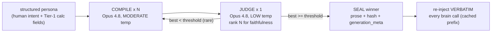

# Persona compile — cooking the prose card from the structured persona

> **STATUS: DESIGNED, UNBUILT** (2026-06-06). This is the methodology for the
> one-time "compile the persona" step: turning the structured persona (human
> intent + Tier-1 calculated fields) into the **prose card** — the only
> persona artifact the brain LLM ever reads. Nothing here is built; `persona/`
> is empty. Supersedes the over-built "deterministic trait-lexicon + separate
> verification stage" sketch that was floated in design chat — that is dropped.
>
> Companions: [persona-authoring.md](persona-authoring.md) (the prose guide),
> [persona-schema.reference.yaml](persona-schema.reference.yaml) (the full output
> shape), [host-persona.template.yaml](host-persona.template.yaml) (the human input).

---

## 1. Why this step exists

The brain LLM never sees the structured persona — not `archetype`, not
`hexaco.H.mu: 0.78`, not `loss_aversion_lambda: 2.10`. Those are **code-food**
(consumed by deterministic reflexes) or **generator seeds**. The LLM is handed a
**prose card**: a second-person character paragraph that *is* the persona, in
natural language. (See [persona-authoring.md](persona-authoring.md) §3-§4 and the
audience split: every field is either LLM-food = prose/words, or CODE-food =
numbers/enums that never reach the brain raw.)

"Compile the persona" = generate that prose card **once, at host birth**, then
**seal it** into the Cornerstone and **re-inject it verbatim** on every inference.

---

## 2. The load-bearing principle: reproducibility comes from SEAL-ONCE, not from a deterministic LLM

This is the whole reason generation entropy is a non-issue at runtime:

- The prose card is cooked **once**, offline, at birth.
- It is **sealed** into `cornerstone` (covered by `cornerstone_hash`).
- At inference it is **re-injected verbatim** from storage — never regenerated.

So every `contemplate_reality()` / brain call for a given host gets the
**byte-identical** prose block. Runtime reproducibility is 100% by construction.

> **There is no API seed.** The Anthropic Messages API exposes no `seed`, and
> `temperature: 0` is not bitwise-deterministic across calls or model versions.
> So "reproducible" does NOT mean "regenerates to the same string." It means:
> **sealed at runtime** + **auditable via `generation_meta`** (model id, prompt
> version, scores). If we ever must re-cook (a schema migration), we re-judge and
> re-seal a fresh card and update the hash — we do not assume it regenerates identically.

This reduces the entire entropy worry to one one-time question: *did we cook a
faithful card?* — answered by §4 (best-of-N) + §5 (the judge), not by temperature.

---

## 3. The pipeline



It is a **best-of-N cook**: generate N candidate prose cards with real diversity,
then a single low-temp judge picks the one most faithful to the structured source.
Cost is irrelevant — this runs once per host, offline, never on the hot path.

**Why best-of-N and not just low temperature:** the two pull in opposite
directions. Low temp cuts variance but does not optimize *faithfulness*, and if
you then generate N copies they come out near-identical, so the judge has nothing
to choose between. Best-of-N *wants* diversity. So:

- **COMPILE = moderate temp** (~0.6-0.8) — genuine candidate diversity.
- **JUDGE = low temp** (~0.0-0.2) — stable ranking.

Different calls, opposite settings, both correct.

---

## 4. The COMPILE call (×N)

**Inputs (everything — the model reads the structured persona directly):**
- the full structured persona JSON (`cornerstone` + the Tier-1 initialized
  `trajectory` baseline — see [persona-schema.reference.yaml](persona-schema.reference.yaml)
  "Bootstrap / preseed")
- world context (RSC setting, the host's cohort home + activity bias)
- the `voice` block and the `quirks` (with their `narrative` seeds)

**Prompt shape (illustrative — to be versioned as `prompt_version`):**

```
SYSTEM:
You are compiling a character for a role-playing simulation. You will be given a
fully-specified persona as structured data. Produce the SECOND-PERSON behavioral
prose card that another model will be handed as "who you are" before it acts.

Hard rules:
- Reflect EVERY structured field faithfully (HEXACO disposition, Schwartz values,
  risk by domain, patience, cooperation style, north star, voice, quirks).
- Do NOT invent traits, history, or relationships beyond what the backstory seed
  licenses. Do NOT contradict any field.
- Write it AS the character's standing disposition, not as a stat block. The
  reader must never see a number, a band label, or the word "archetype".
- Match the specified voice (register, formality, typo feel).
- ~120-200 words. Then a short "Things you never forget:" list from the pinned memories.

PERSONA (structured):
<persona JSON>

WORLD/VOICE/QUIRK CONTEXT:
<context>
```

Run this N times (N = 5-8 is fine; cost is a non-factor for a one-time cook).

---

## 5. The JUDGE call (×1) — the faithfulness gate

A single low-temp Opus call ranks all N candidates against the structured source.
The judge **is** the verification gate (no separate NLI/keyword stage).

**Inputs:** the structured persona JSON + all N candidate cards + the rubric.

**Rubric — score each candidate 0-10 per criterion:**

| Criterion | What it checks |
|---|---|
| **Coverage** | every structured field is reflected (HEXACO, values, risk, patience, coop_type, north star, quirks, voice) |
| **Non-contradiction** | nothing in the prose contradicts a field (no "generous" for a low-H scammer) |
| **No invention** | nothing fabricated beyond the backstory seed's license (no invented friends, events, items) |
| **Voice match** | register, formality, typo feel match the `voice` block |
| **No leakage** | no numbers, band labels, jargon, or the archetype tag appear |

**Output (structured):**
```jsonc
{ "best_index": 3,
  "scores": [ {"i":0,"coverage":8,"non_contradiction":9,...,"total":41}, ... ],
  "winner_violations": []   // any fidelity issues in the winner; empty = clean
}
```

**Decision:** pick `best_index`. If `winner.total < threshold` OR
`winner_violations` is non-empty on a hard criterion (contradiction / leakage),
**regenerate a fresh batch** (rare). Otherwise seal.

> The judge has its own entropy, but *ranking* is far more stable than
> *generation*, and low temp + a fixed rubric makes it stable enough. Its job is
> selection + a quality floor, not bitwise determinism.

---

## 6. Seal

Store the winner and freeze it:

```jsonc
"identity": { "backstory": "<winning prose card>" , ... },   // sealed into cornerstone
"generation_meta": {
  "prose_model_id": "claude-opus-4-8",
  "prose_prompt_version": "compile-v1",
  "prose_candidates_n": 6,
  "prose_judge_scores": [ ... ],          // for audit / cohort science
  "prose_judge_winner": 3
}
```

Then `cornerstone_hash = sha256(canonical_json(cornerstone))` covers it. From here
the card is immutable and re-injected verbatim as the cache-prefixed system block
on every brain call (~100% per-host cache hit).

---

## 7. What this step does NOT do (carve-outs)

- **It does not generate the per-call mood line.** The static prose card is cooked
  once. The *dynamic* affect line in the prompt (`"you feel calm and pleased"`,
  derived from the drifting `trajectory.mood` numbers) changes every inference, so
  it is a **deterministic template lookup**, NOT an LLM call:
  `valence>0.1 ∧ confidence>0.5 → "calm and pleased"`. Putting an LLM call in the
  per-inference projection path would re-introduce entropy + latency + cost on the
  hot path — exactly what sealing the static card avoids. Keep the hot-path
  projection 100% deterministic.
- **It does not sample the numbers.** HEXACO mu, econ anchors, etc. are drawn by
  the offline deterministic sampler *before* this step (genpop). Compile only
  renders the already-sealed structured fields into prose.
- **It does not touch the trust ledger or any `trajectory` adaptation.** Those are
  runtime-owned and created lazily.

---

## 8. The deterministic fallback (the reproducibility floor)

`persona.Persona.Render()` ships a **deterministic, no-LLM template** that emits a
faithful-if-flatter card directly from the structured fields (keeps `go test`
green with no API key; covers hosts cooked before the LLM pipeline exists). The
best-of-N cook is the *quality upgrade* on top of this floor — never a dependency
for the system to run. (See [decision-persona-schema.md](_research/reference/decision-persona-schema.md)
§2 `Render()`.)

---

## 9. Reconciliation with earlier docs

- Earlier notes said the LLM materialization is "1 batched call per ~50 hosts."
  That framing was a cost-minimizing default. The settled decision: **the prose
  cook is best-of-N PER host** (cost is a non-factor for a one-time offline step),
  while the **numeric sampling** stays offline/deterministic and can still be
  batched. Where the two disagree, this doc governs the prose cook.
- The "deterministic trait-lexicon assertion layer + separate verification stage"
  floated in chat is **dropped** — Opus reads the structured fields directly; the
  judge folds in verification.

---

## 10. Cross-references
- [persona-authoring.md](persona-authoring.md) — the field guide + the LLM-food/CODE-food audience split.
- [persona-schema.reference.yaml](persona-schema.reference.yaml) — the full stored shape + preseed tiers.
- [host-persona.template.yaml](host-persona.template.yaml) — the human input that seeds compile.
- [`_research/reference/decision-persona-schema.md`](_research/reference/decision-persona-schema.md) — the PersonaCompiler + `Render()` + the "brain sees prose only" decision.
- [`_research/quantitative-persona-models.md`](_research/quantitative-persona-models.md) §3 (model 7) — seal + re-inject-every-inference discipline.
