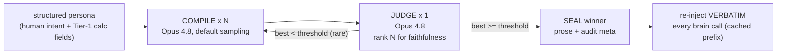

# Persona compile — cooking the prose card from the structured persona

> **STATUS: BUILT** (verified 2026-06-10 against branch HEAD `0bfa818`). This is
> the methodology for the one-time "compile the persona" step: turning the
> structured persona (human intent + Tier-1 calculated fields) into the **prose
> card** — the only persona artifact the brain LLM ever reads. Where it lives:
>
> - **Compiler seam + floor** — `persona/compile.go`: the `ProseCook` interface,
>   `DeterministicCook` (no-LLM floor), `Cooked`/`CookMeta` (audit shape),
>   `PersonaCard`/`Project()` (login-time hydration), `MoodLine()`.
> - **Deterministic render floor** — `persona/render.go`: `Render()`, the fixed
>   trait-lexicon card (leak-free; omits middling traits).
> - **Opus best-of-N cook + judge** — `mesa/personacook/` (CLI, mesa-side,
>   key-gated): `cook.go` carries the real `cookSystemPrompt` + `judgeSystemPrompt`;
>   `anthropic.go` is a raw net/http Messages client.
> - **Persistence + runtime injection** — `mesa/mesad/server.go` `Register` →
>   `decideSystem(prose)`; `mesa/mesad/ltm.go` `personas` table
>   (`prose_card` + `cooked` columns); `act.go` reuses the same prose for the
>   chat/ask system prompts; `mesa/llm` marks the system block with an ephemeral
>   `cache_control` so the prefix is prompt-cached.
>
> **Deltas from the original spec** (kept inline below, marked **[delta]**):
> 1. **No auto-regen loop** — the judge's below-threshold "regenerate a fresh
>    batch" edge is operator-in-the-loop today ([TODO.md](TODO.md) P-8).
> 2. **No `cornerstone_hash`** — it exists only as a comment
>    (`persona/policy.go:262`); seal integrity is TODO P-8.
> 3. **Audit meta shape** — `persona.CookMeta` is the in-code audit type; what
>    persists is the `prose_card`+`cooked` columns in mesad's `personas` table
>    plus `generation_meta.llm_materialized` in the persona JSON — not the
>    spec's original per-cook `generation_meta` JSON block (see §6).
> 4. **No temperature knobs** — Opus 4.8 deprecated `temperature`
>    (`mesa/personacook/anthropic.go`); best-of-N diversity comes from the
>    model's default sampling across independent calls.
>
> Companions: [persona-authoring.md](persona-authoring.md) (the prose guide),
> [persona-schema.reference.yaml](persona-schema.reference.yaml) (the full output
> shape), [host-persona.template.yaml](host-persona.template.yaml) (the human input).

---

## 1. Why this step exists

The brain LLM never sees the structured persona — not `archetype`, not
`hexaco.H.mu: 0.78`, not `loss_aversion_lambda: 2.10`. Those are **code-food**
(consumed by deterministic reflexes) or **generator seeds**. The LLM is handed a
**prose card**: a second-person character paragraph that *is* the persona, in
natural language. (See [persona-authoring.md](persona-authoring.md) §3-§4 and the
audience split: every field is either LLM-food = prose/words, or CODE-food =
numbers/enums that never reach the brain raw.)

"Compile the persona" = generate that prose card **once, at host birth**, then
**seal it** into the Cornerstone and **re-inject it verbatim** on every inference.

---

## 2. The load-bearing principle: reproducibility comes from SEAL-ONCE, not from a deterministic LLM

This is the whole reason generation entropy is a non-issue at runtime:

- The prose card is cooked **once**, offline, at birth.
- It is **sealed** into `cornerstone.identity.backstory` — "the only thing the
  brain reads" (`persona/persona.go` `Identity.Backstory`). **[delta]** There is
  no `cornerstone_hash` covering it yet (TODO P-8).
- At inference it is **re-injected verbatim** from storage — never regenerated.
  In practice: mesad renders the prose once at registration
  (`server.go` `registerLocal` → `decideSystem(prose)`) and reuses that exact
  system prompt on every Decide/Chat/Ask call, with `mesa/llm` prompt-caching
  the prefix.

So every brain call for a given host gets the **byte-identical** prose block.
Runtime reproducibility is 100% by construction.

> **There is no API seed.** The Anthropic Messages API exposes no `seed`, and
> Opus 4.8 deprecated `temperature` outright — the client intentionally omits it
> (`mesa/personacook/anthropic.go` `msgRequest`). So "reproducible" does NOT mean
> "regenerates to the same string." It means: **sealed at runtime** + **auditable
> via `CookMeta`** (model id, prompt version, candidate count, judge scores). If
> we ever must re-cook (a schema migration), we re-judge and re-seal a fresh card
> — we do not assume it regenerates identically.

This reduces the entire entropy worry to one one-time question: *did we cook a
faithful card?* — answered by §4 (best-of-N) + §5 (the judge), not by temperature.

---

## 3. The pipeline



It is a **best-of-N cook**: generate N candidate prose cards with real diversity,
then a single judge picks the one most faithful to the structured source. Cost is
irrelevant — this runs once per host, offline, never on the hot path.

**BUILT as the `mesa/personacook` CLI:**

```
source .local.env && go run ./mesa/personacook -persona docs/personas/dolores.json -n 20
```

Flags: `-n` candidates (default 20, cooked concurrently, `-concurrency 5`),
`-model` (default `claude-opus-4-8`), `-judge` (default true), `-max-tokens 700`,
`-out` (markdown report: every candidate + the judge pick + score table, so you
can SEE the jitter). It validates the persona (`Validate()`) before touching the
network and is key-gated on `ANTHROPIC_API_KEY` — the host never makes external
calls.

**Why best-of-N and not "turn the temperature down":** the original framing was
moderate-temp compile vs low-temp judge; **[delta]** Opus 4.8 controls sampling
itself, so the implementation relies on default-sampling variation across N
independent calls for diversity, and on the fixed rubric (not a temperature) for
judge stability. The principle survives: the compile step *wants* diversity, the
judge step wants a stable ranking.

---

## 4. The COMPILE call (×N)

**Inputs (everything — the model reads the structured persona directly):**
- the full structured persona JSON (`cornerstone` + the Tier-1 initialized
  `trajectory` baseline — see [persona-schema.reference.yaml](persona-schema.reference.yaml)
  "Bootstrap / preseed")
- world context: a curated `persona.WorldBrief` (setting, cohort home, activity
  bias, a few wiki-distilled entities — `persona/compile.go`). The cook does NOT
  do live wiki RAG (the card is about WHO, not HOW). Today the brief is the
  hand-built `lumbridgeBrief()` in `mesa/personacook/main.go`; generating it from
  the persona is the knowledge-pipeline Stage 1 (TODO M-1).
- the `voice` block and the `quirks` (with their `narrative` seeds)

**Prompt: BUILT as `cookSystemPrompt`** (`mesa/personacook/cook.go`). Its hard
rules, as shipped:

- Reflect EVERY structured field faithfully — HEXACO, values, domain risk,
  patience, cooperation style, **the additive dials** (aggression, decisiveness,
  tenacity, bulk apperception), north star, voice, quirks.
- Pinned memories are formative and may sit in TENSION with the surface
  disposition — honor the tension, don't flatten it.
- Do NOT invent traits, history, relationships, or events beyond what the
  persona licenses.
- Write the standing disposition, not a stat block: the reader must NEVER see a
  number, a band word, "HEXACO", or an archetype tag.
- Match the voice (register, formality, typo feel).
- ~120-200 words of second-person prose, then a "Things you never forget:" list
  drawn ONLY from the pinned memories. Output only the card.

Each candidate is one Messages call: system prompt + a user message of the
persona JSON and the world-brief text (`opusCook.cookOne`). Run N times — N=20
is the CLI default; cost is a non-factor for a one-time cook.

---

## 5. The JUDGE call (×1) — the faithfulness gate

A single Opus call ranks all N candidates against the structured source. The
judge **is** the verification gate (no separate NLI/keyword stage). **BUILT as
`judgeSystemPrompt` + `opusCook.judge`** (`mesa/personacook/cook.go`); the parser
tolerates code-fenced/prose-wrapped JSON (`extractJSON`).

**Inputs:** the structured persona JSON + all N candidate cards + the rubric.

**Rubric — score each candidate 0-10 per criterion (verbatim in the shipped prompt):**

| Criterion | What it checks |
|---|---|
| **coverage** | every structured field is reflected (HEXACO, values, risk, patience, cooperation, the additive dials, north star, quirks, voice, pinned memories) |
| **non_contradiction** | nothing in the prose contradicts a field (no "generous and trusting" for a low-honesty exploiter) |
| **no_invention** | nothing fabricated beyond what the persona licenses |
| **voice_match** | register, formality, typo feel match the `voice` block |
| **no_leakage** | no numbers, band words, "HEXACO", or archetype tags appear |

**Output (structured):**
```jsonc
{ "best_index": 3,
  "scores": [ {"i":0,"coverage":8,"non_contradiction":9,...,"total":41}, ... ],
  "winner_violations": []   // any fidelity issues in the winner; empty = clean
}
```

**Decision:** pick `best_index`. **[delta]** The spec's "if below threshold OR a
hard violation, regenerate a fresh batch" edge is not automated — the CLI prints
the pick, scores, and `winner_violations`, and the operator is the loop. The
automated regen loop is TODO P-8.

> The judge has its own entropy, but *ranking* is far more stable than
> *generation*, and a fixed rubric makes it stable enough. Its job is selection
> + a quality floor, not bitwise determinism.

---

## 6. Seal

**[delta] What ships differs from the original `generation_meta` sketch:**

- **Seal location:** the winning card goes into
  `cornerstone.identity.backstory` (`persona/persona.go`) and the persona sets
  `generation_meta.llm_materialized: true`. Sealing is **operator-manual today**
  — nothing in the codebase writes `Backstory`; you paste the judge's pick from
  the personacook report into the persona JSON.
- **Audit trail:** `persona.CookMeta` (`persona/compile.go`) is the in-code
  shape — `prose_model_id`, `prose_prompt_version`, `prose_candidates_n`,
  `prose_judge_winner`, `prose_judge_scores` — returned by every
  `ProseCook.Cook`. It is **not yet persisted per host**; the personacook
  `-out` markdown report is the audit artifact for now.
- **Persistence:** mesad's `personas` table stores the canonical
  `persona_json` plus app-written `prose_card` and `cooked` columns
  (`mesa/mesad/ltm.go` schema + `UpsertPersona`); `cooked` is set from
  `Gen.LLMMaterialized` at `Register` (`mesa/mesad/server.go`).
- **No `cornerstone_hash`** — the planned
  `sha256(canonical_json(cornerstone))` exists only as a comment
  (`persona/policy.go:262`, the policy fingerprint placeholder). TODO P-8.

From the seal on, the card is re-injected verbatim: `persona.Project()` prefers
the sealed `Backstory` and falls back to `Render()` when uncooked
(`persona/compile.go`, covered by `compile_test.go`); mesad's prose-derived
system prompts are computed once per registration and prompt-cached per host.

**Current fleet state:** `docs/personas/dolores.json` is uncooked (`backstory`
empty, `llm_materialized: false`) — production runs on the `Render()` floor; the
Opus cook has been exercised via the CLI but no production persona is sealed yet.

---

## 7. What this step does NOT do (carve-outs)

- **It does not generate the per-call mood line.** The static prose card is cooked
  once. The *dynamic* affect line (`"You currently feel steady and content."`,
  derived from the drifting `trajectory.mood` numbers) changes every inference, so
  it is a **deterministic template lookup**, NOT an LLM call — BUILT as
  `persona.MoodLine()` (`persona/compile.go`), a fixed arousal/valence lexicon.
  Putting an LLM call in the per-inference projection path would re-introduce
  entropy + latency + cost on the hot path — exactly what sealing the static card
  avoids. Keep the hot-path projection 100% deterministic.
- **It does not sample the numbers.** HEXACO mu, econ anchors, etc. are drawn by
  the offline deterministic sampler *before* this step (the genpop sampler —
  still unbuilt, TODO P-3). Compile only renders the already-sealed structured
  fields into prose.
- **It does not touch the trust ledger or any `trajectory` adaptation.** Those are
  runtime-owned and created lazily.
- **It does not compile the policy half of the card.** `PersonaCard` carries
  prose + pinned + mood; EventPolicy / ChoiceWeights / Directives / ReverieKernel
  compilation into the card is the open band→policy slice
  (`persona/compile.go:33`, TODO P-4). The deterministic pearl-policy compile
  (`persona.CompilePolicy`, `persona/policy.go`) is a separate, built path.

---

## 8. The deterministic fallback (the reproducibility floor)

`persona.Render()` (`persona/render.go`) is a **deterministic, no-LLM template**
that emits a faithful-if-flatter card directly from the structured fields — a
fixed trait lexicon over the HEXACO bands, coop type, domain risk, the
pronounced dials, curiosity pulls, north star, voice, and pinned memories;
leak-free by the same no-numbers/no-bands rule. It keeps `go test` green with no
API key and covers hosts cooked before the LLM pipeline ran (i.e., the whole
fleet today). `DeterministicCook` (`persona/compile.go`) wraps it as the
`ProseCook` floor. The best-of-N cook is the *quality upgrade* on top of this
floor — never a dependency for the system to run. (See
[persona-schema.md](persona-schema.md)
§2 `Render()`.)

---

## 9. Reconciliation with earlier docs

- Earlier notes said the LLM materialization is "1 batched call per ~50 hosts."
  That framing was a cost-minimizing default. The settled decision: **the prose
  cook is best-of-N PER host** (cost is a non-factor for a one-time offline step),
  while the **numeric sampling** stays offline/deterministic and can still be
  batched. Where the two disagree, this doc governs the prose cook.
- The "deterministic trait-lexicon assertion layer + separate verification stage"
  floated in chat is **dropped** — Opus reads the structured fields directly; the
  judge folds in verification. (The trait lexicon survives only as the `Render()`
  generation floor, not as a verification stage.)

---

## 10. Open items

Tracked in [TODO.md](TODO.md): **P-8** (cornerstone_hash seal integrity +
automated regen-below-threshold loop), **P-4** (band→policy compile into
`PersonaCard`), **P-3** (genpop sampler), **M-4** (`mesa-ctl persona recook`),
**M-1** (generated `WorldBrief` / knowledge-pipeline Stage 1).

## 11. Cross-references
- `persona/compile.go` / `persona/render.go` — the seam, the floor, the card.
- `mesa/personacook/` — the Opus best-of-N cook + judge CLI.
- [persona-authoring.md](persona-authoring.md) — the field guide + the LLM-food/CODE-food audience split.
- [persona-schema.reference.yaml](persona-schema.reference.yaml) — the full stored shape + preseed tiers.
- [host-persona.template.yaml](host-persona.template.yaml) — the human input that seeds compile.
- [persona-schema.md](persona-schema.md) — the PersonaCompiler + `Render()` + the "brain sees prose only" decision (tracked copy; promoted from `_research/reference/decision-persona-schema.md` 2026-06-10).
- [`_research/quantitative-persona-models.md`](_research/quantitative-persona-models.md) §3 (model 7) — seal + re-inject-every-inference discipline.
